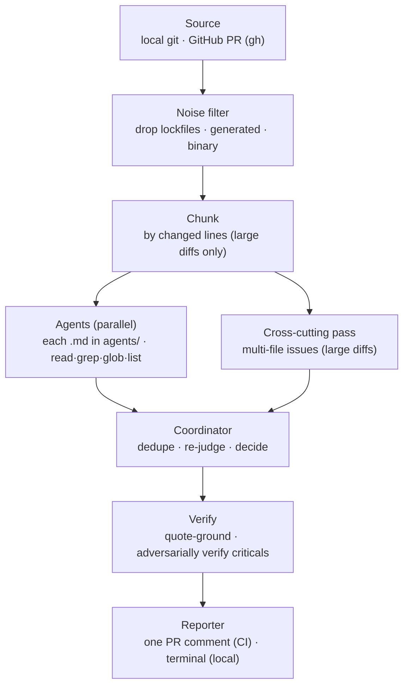

# @expo/code-review-cli

A config-driven, multi-agent AI code reviewer. Specialist agents review a diff in
parallel; a coordinator consolidates their findings into one structured review.
The same engine runs locally (advisory) and in CI (posts one PR comment). The CLI
is the **engine** — each repo supplies its own agents and settings under
`.expo-code-review/`, so behavior is configured per-repo, not baked in.

> **Status: experimental.** Comment-only and non-blocking — it never blocks a merge
> and never auto-approves. See [`ROADMAP.md`](./ROADMAP.md).

Inspired in part by Cloudflare's [_How we built our AI code review bot_](https://blog.cloudflare.com/ai-code-review/).



## Usage

Run via `npx @expo/code-review-cli <command>` (or the `ecr` / `expo-code-review`
binary once installed). On a repo that already has `.expo-code-review/` set up,
getting model credentials for local runs is one command:

```bash
npx @expo/code-review-cli setup-auth
```

Reviewing a PR (`--pr`/`ci`) needs the GitHub CLI — `brew install gh && gh auth login`.
Everything else the reviewer needs (including the `opencode` runtime) ships with the
package.

### First-time setup

```bash
# 1. Scaffold .expo-code-review/ + a CI workflow (--no-workflow to skip)
npx @expo/code-review-cli init
# 2. Get model credentials — guided; prints the export lines for your shell config
npx @expo/code-review-cli setup-auth
# 3. Verify env, config, and credentials
npx @expo/code-review-cli doctor
```

`setup-auth` reads the repo's config and walks through each credential it needs:
an OpenAI **API key** (the scaffolded default — it prints where to create the key
and the exact restricted permissions to grant), and/or a **ChatGPT/Codex
subscription** sign-in (it runs OpenCode's browser login and extracts the token
for you). `doctor` offers to run it whenever a credential is missing.

In CI, store the same values as repo secrets (`OPENAI_API_KEY`; plus
`CODEX_OAUTH_ACCESS_TOKEN` for the mixed setup) — the scaffolded workflow
forwards them.

**Have a ChatGPT Plus/Pro (Codex) subscription? Use both.** The recommended
production setup pairs the subscription (runs the default models at no marginal
cost) with the usage-based key (covers only the pro-tier models the subscription
excludes) — see [the mixed setup](#other-providers) below. Prefer
**Anthropic/Claude** or another provider? Same section.

### Reviewing (already configured)

```bash
# Review working-tree changes; prints here, posts nothing
ecr review
# Review a GitHub PR by number (preview only)
ecr review --pr 4057
# …and post it as the PR comment
ecr review --pr 4057 --post
```

Options (most to least common):

| Flag | What it does |
| --- | --- |
| `--pr <n>` | Review GitHub PR #n by number (diff fetched via `gh`, no checkout); not combinable with `--base`/`--head`/`--staged`. |
| `--post` | With `--pr`, also post the result as the PR comment (needs `gh` auth). Omit to preview only; re-run with `--post` to publish. |
| `--staged` | Review only staged changes (index vs HEAD; not combinable with `--base`/`--head`). |
| `--base <ref>` | Base ref to diff against (default: merge-base with the default branch). |
| `--head <ref>` | Head ref to diff (default: working tree, incl. uncommitted changes). |
| `--agents <a,b>` | Run only these agents (comma-separated ids); default: all. |
| `--route` | Let an LLM router pick the relevant agents from the diff. |
| `--repo <owner/repo>` | Repo for `--pr` (default: inferred from the current checkout). |
| `--json` | Emit machine-readable JSON on stdout. |
| `--no-fail` | Always exit 0 (otherwise a `request_changes` decision exits non-zero). |
| `-h`, `--help` | Show help. |

`--pr` uses the PR's diff (authoritative) and checks the PR head out into a
throwaway worktree so the agents' surrounding-source reads and the verifier see the
PR's versions of files — no manual `gh pr checkout` needed, and your working tree is
left untouched. (If that materialization can't run — e.g. not a git checkout — it
falls back to reading the current working directory.)

In CI it runs automatically from the scaffolded workflows — by label or a `/review`
comment (see **CI usage**). From Claude Code (or another agent), add a slash command
that runs it; eas-cli's
[`/expo-review`](https://github.com/expo/eas-cli/blob/main/.claude/commands/expo-review.md)
is a ready example to adapt.

### Command reference

| Command | What it does |
| --- | --- |
| `ecr init [--no-workflow] [--force]` | Scaffold `.expo-code-review/` (config, agents, prompts) + a CI workflow. |
| `ecr init --monorepo` | …and add a `routing.jsonc` routing manifest (one default scope). |
| `ecr init --scope <dir>` | Scaffold a per-team scope under `<dir>` and register it in the manifest. |
| `ecr setup-auth [--yes]` | Walk through getting model credentials for local runs (ChatGPT sign-in and/or API keys), printing the `export` lines for your shell config. |
| `ecr review [options]` | Review local changes and print an advisory review (default command). |
| `ecr review --scope <name>` | Review only one routing scope over just that scope's changed files. |
| `ecr ci` | Review the current GitHub PR and post/update a comment. For GitHub Actions. |
| `ecr doctor [--list-scopes]` | Check environment, config, credentials, and (with a manifest) scopes. |

Extra flags for monorepos: `review`/`ci` `--config-dir <dir>` (load config from an
alternate dir; also `ECR_CONFIG_DIR`), `ci --scopes a,b` (limit the fan-out to
named scopes), `ci --comment single|per-scope` (override the manifest).

(When developing this repo itself, use `bun run src/cli.ts <command>`.)

---

## Monorepos (routing manifest)

A monorepo can route different subtrees to different reviewer rosters from a single
infra-owned manifest. There is still **one workflow, one `ecr ci` process** per PR:
it reads the changed files once, assigns each to exactly one scope, reviews each
active scope over only its files, and renders one comment. Because it is a single
writer in a single process there is no comment/check race and no locking.

```
your-monorepo/
  .expo-code-review/
    routing.jsonc          # the manifest — infra-owned, ordered scope list + locked defaults
    config.jsonc           # the default/root scope; the ONLY place auth/tokenEnv lives
    shared.md coordinator.md agents/
  server/
    www/.expo-code-review/{config.jsonc(NO auth),coordinator.md,agents/}       # www team
    website/.expo-code-review/{config.jsonc(NO auth),coordinator.md,agents/}   # website team
  .github/workflows/expo-code-review.yml   # unchanged shape: one workflow, one `ecr ci`
```

```jsonc
// .expo-code-review/routing.jsonc
{
  // Central guardrails every scope inherits and CANNOT override.
  "defaults": {
    // The ONLY place auth/tokenEnv is honored (besides the root config.jsonc).
    "auth": { "mode": "api-key", "provider": "openai", "tokenEnv": "OPENAI_API_KEY" },
    "enforceAgents": ["security"],            // always runs on every scope, roster or not
    "commentTag": "expo-ai-code-reviewer"     // per-scope markers derive from this
  },
  "comment": "single",   // "single" = one aggregated comment (default) | "per-scope"
  // Ordered; the LAST matching scope wins per changed file (CODEOWNERS discipline).
  "scopes": [
    { "name": "default",        "paths": ["**/*"],              "config": "." },
    { "name": "server-www",     "paths": ["server/www/**"],     "config": "server/www" },
    { "name": "server-website", "paths": ["server/website/**"], "config": "server/website" }
  ]
}
```

```jsonc
// server/www/.expo-code-review/config.jsonc  (the www team owns this)
{
  // NO "auth" block — locked centrally; a tokenEnv here is rejected by loader + CI guard.
  "model": "openai/gpt-5.5",
  "policy": { "includeSuggestions": false },
  "noise":  { "additionalIgnores": ["server/www/**/__generated__/**"] }
  // shared.md, coordinator.md, agents/*.md live beside this file — the www team's roster.
}
```

- **Path glob dialect** — `**` crosses `/`, `*` matches within a segment. Keep a
  `**/*` catch-all scope so no changed file goes unreviewed (`ecr doctor` flags a
  coverage gap otherwise). Scopes are ordered and the **last** match wins, so put
  broad scopes first and specific ones after (CODEOWNERS/Renovate discipline).
- **Comment modes** — `single` posts one aggregated comment (a scope summary table
  + a collapsed `<details>` per scope) under the existing marker; `per-scope` posts
  one cleanly-namespaced comment per scope. A scope with zero matched files gets its
  stale comment deleted.
- **Scoped flags** — `ecr ci --scopes a,b` limits the fan-out; `ecr ci --comment
  single|per-scope` overrides the manifest; `ecr review --scope <name>` runs one
  scope locally; `ecr review`/`ecr ci --config-dir <dir>` (or `ECR_CONFIG_DIR`)
  load config from an alternate directory; `ecr doctor --list-scopes` prints the
  scope table. **`--config-dir` designates an alternate ROOT config dir: both
  `config.jsonc` and `routing.jsonc` are read from it, so the root config and its
  manifest always travel together. Scope `config` paths stay repo-root-relative —
  the override swaps the root config/manifest against the *real* scope tree, it
  does not relocate the scopes themselves.**
- **Passes budget** — `defaults`-level `budget` bounds total review time:
  `totalPassesMinutes` (default 55) is split across active scopes (which run
  sequentially in one `ecr ci`), clamped up to `minScopeMinutes` (default 5) so a
  single scope still gets a workable window. When enough scopes are active that the
  floor would overshoot the total, `ecr ci` keeps the floor but warns, and `ecr
  doctor` flags the worst case (`scopes × floor` vs total) — raise the workflow
  `timeout-minutes` or trim scopes.
- **Adoption is incremental** — with no `routing.jsonc`, behavior is exactly as
  before (single config). Add the manifest with just a default scope → still one
  comment, identical behavior. Land per-team scope dirs one at a time; everything
  else keeps hitting the default scope.

### Security

- **auth is locked to the root.** `tokenEnv` (which env var becomes the model
  credential) is honored in exactly one place: the root `config.jsonc` or
  `routing.jsonc` `defaults.auth`. A scope config declaring `auth`/`breakGlass`
  **fails to parse** (Zod-level rejection), and the CI guard step independently
  sweeps every `.expo-code-review/config.jsonc`/`routing.jsonc` repo-wide and refuses
  to run unless `tokenEnv` appears exactly once, in a root-owned file, equal to
  `ECR_EXPECTED_TOKEN_ENV`. A routing manifest can never widen exposure — globs only
  choose *which roster* reviews a file, never *which secret* is sent.
- **enforceAgents can't be weakened.** Agents listed in `defaults.enforceAgents`
  (e.g. `security`) are injected into every scope with `alwaysRun`, taken from the
  root roster — a scope defining a same-id agent gets the root one, so a team can't
  shadow the enforced reviewer with a weaker version on its own subtree.
- **Config comes from the checked-out ref (documented tradeoff).** The scaffolded
  auto workflow checks out the PR **merge ref**, so a PR *can* edit rosters, prompts,
  and routing globs for its own advisory review — that only steers what the
  comment-only reviewer says about that PR. What a PR can **never** do is touch
  credentials: `auth` is locked by the scope-schema rejection, the CLI's runtime
  `ECR_EXPECTED_TOKEN_ENV` check, and the guard step above, all three of which run
  against whatever ref is checked out. A `/review`-command workflow that checks out
  only the trusted base ref (see eas-cli's) closes the prompt-tampering vector too;
  resolving config from the base ref on the auto path as well is on the
  [roadmap](./ROADMAP.md).

Ownership is enforced with CODEOWNERS: `/.expo-code-review/routing.jsonc @your-infra`
(the single authoritative router) and `/server/www/.expo-code-review/ @your-www-team`
(each team owns only its own scope dir). Rerouting globs is gated behind infra review.

---

<details>
<summary><b>How it works</b></summary>

- **Source** — local git (working tree, staged, or a ref range) or a GitHub PR
  (diff + metadata fetched over the `gh` API).
- **Noise filter** — drops lockfiles, generated bundles/maps, snapshots, files
  matching the repo's `additionalIgnores`, and binary files (no textual diff to
  review). Filtered files are recorded, not silently dropped.
- **Chunking** — small PRs run in a single pass; large PRs are split into chunks
  bounded by changed lines, plus one combined **cross-cutting pass** that looks
  for issues spanning multiple changed files across every agent's concern.
- **Agents** — every `.md` file in `.expo-code-review/agents/` is an agent. They
  run in parallel with read-only repo tools (`read`/`grep`/`glob`/`list`).
- **Coordinator** — a single pass that dedupes, re-judges severity, and produces
  the final `{ decision, findings, summary }`.
- **Verify** — quote-grounds every finding against the real file and adversarially
  verifies criticals, so a confident-but-wrong finding doesn't ship.
- **Reporter** — posts/updates a single fingerprinted PR comment (CI), or prints
  a grouped summary (local). Findings below the configured severity floor are
  suppressed.

Built on the [OpenCode](https://opencode.ai) SDK, which spawns the model provider
and applies the provider's prompt caching automatically.

</details>

<details>
<summary><b>Tokens, cost &amp; prompt caching</b></summary>

Every run reports what it spent and how much of it was served from the prompt
cache, in three places:

- **Job log (stderr)** — one line at the end of the run:
  `Token usage — input …, output …, cache read …, cache write … (cost $…)`.
- **GitHub Actions step summary** — a per-pass table (one row per agent, plus the
  cross-cutting pass, coordinator, and verifier), the run's cache hit rate, and
  the exact comment that was posted. The PR comment is updated in place on every
  run, so the step summary is where past runs' comments remain readable.
- **`.expo-code-review/.runs/reviews.jsonl`** — one JSON line per run (uploaded as
  a CI artifact) with the same totals plus per-pass `agentTokens`, the raw
  per-agent findings, coverage notes, and what the verifier dropped.

**How the caching works.** Provider prompt caching is a *prefix match*: the
provider caches the rendered prompt up to a point, and any byte change anywhere
in that prefix invalidates everything after it. The reviewer is laid out so the
prefix is stable — the system prompt (`shared.md` + the agent's own `.md`) is
byte-identical for every chunk an agent reviews, while the volatile parts (the
diff, file lists, PR metadata) travel in the user message *after* the prefix and
never touch it. OpenAI caches automatically (no write premium; cached input is
billed at a steep discount and shows up as `cache read`); Anthropic charges a
small premium to **write** the cache (~1.25× input) and ~0.1× input to **read**
it. Entries live minutes, refreshed on use — comfortably covering a run's
concurrent calls.

**Reading the numbers.** Hit rate = `cache read / (cache read + input)` — the
share of prompt tokens served from cache instead of being reprocessed at full
price. Multi-chunk reviews should show a high rate; single-chunk reviews mostly
show writes (there is nothing to re-read within the run).

**Keeping hits high:**

- Keep `shared.md` and `agents/*.md` stable. Any edit writes a new prefix — one
  extra cache write per agent on the next run, then it is warm again. Never put
  varying text (dates, PR numbers) into prompt files.
- Very short prompts may show `cache read 0`: prompts below the model's minimum
  cacheable size (~1–4K tokens depending on the model) are silently not cached.
  That is expected, not a bug.

</details>

<details>
<summary><b>Configuration — <code>.expo-code-review/</code></b></summary>

```
.expo-code-review/
  config.jsonc        # model, policy, noise, auth, break-glass, comment tag
  shared.md           # instructions prepended to every agent (optional)
  coordinator.md      # the consolidation prompt (required)
  agents/
    correctness.md    # each .md here is an agent (id = filename)
    security.md
    consistency.md
```

`shared.md` and `coordinator.md` are reserved names; every other `.md` in
`agents/` becomes an agent. Per-agent overrides go in each file's frontmatter:

```markdown
---
description: One line the router uses to decide relevance.
alwaysRun: true        # run even when the router would skip this agent
model: openai/gpt-5.5-pro     # override the default model
temperature: 0.1
---

# Agent instructions in Markdown…
```

For a real-world example, see eas-cli's
[`.expo-code-review/`](https://github.com/expo/eas-cli/tree/main/.expo-code-review)
— correctness/security/consistency agents, a stronger model for security + the
coordinator, and per-repo `noise.additionalIgnores`.

`config.jsonc` (JSONC — comments + trailing commas supported):

```jsonc
{
  "model": "openai/gpt-5.5",                  // default model for the specialists
  "policy": { "includeSuggestions": false },  // suppress suggestion-severity findings
  "chunk": { "maxChangedLines": 1000, "maxFiles": 20 },  // concurrency defaults: 6 (API key) / 3 (subscription)
  "noise": { "additionalIgnores": ["packages/*/build/**"] },
  "review": { "trigger": "all",               // which PRs `ecr ci` reviews: "all"
              "label": "ai-review",            // (default, except ai-review:skip) or
              "skipLabel": "ai-review:skip" }, // "label" (only labeled PRs)
  "breakGlass": { "marker": "/skip-review" }, // PR body marker that skips the review
  "commentTag": "expo-ai-code-reviewer",      // hidden tag used to find/update the comment
  "auth": { "mode": "api-key", "provider": "openai",
            "tokenEnv": "OPENAI_API_KEY" }
}
```

</details>

<details>
<summary><b>Model selection</b></summary>

Precedence: **`REVIEWER_MODEL` env** (global override) → per-file **frontmatter
`model:`** → **`config.jsonc` `model`** (the default). So a repo can run a mixed
setup, and a developer can override everything locally.

- **Specialist agents** (correctness/security/consistency) benefit from a
  reasoning-tier model — **`openai/gpt-5.5`** is the quality/speed sweet spot
  (the scaffolded default). The **pro tier** finds more but is slower and more
  expensive, so scope it to the highest-stakes agent: **security runs on
  `openai/gpt-5.5-pro`** (set in `security.md` frontmatter), the rest on the default.
- **The coordinator** makes the final call (dedupe / re-judge / decide) — worth a
  strong model; set it in `coordinator.md` frontmatter.
- If latency/timeouts dominate on big PRs, moving the specialists to a faster model
  (e.g. `openai/gpt-5.4-mini`) is the most direct lever (a real recall tradeoff —
  measure it).
- **Every run logs which model actually answered each pass** — in the job log
  (`Models used — …`), the Actions step summary table, and the run log's
  `agentModels` — and warns loudly if a pass ran on a different model than
  configured, so a provider-side substitution can never pass unnoticed.

There is no automatic cross-provider "equivalent" fallback — that would silently
change which model reviewed your code. Use an explicit override instead.

</details>

<details>
<summary><b>Reliability</b> — never hangs, never silently drops work</summary>

- **Per-task time caps** — chunk passes 15 min; coordinator 10 min. A global passes
  budget (55 min) bounds all passes incl. the subdivision waves, fitting inside the
  CI job's `timeout-minutes` (90).
- **The cross-file pass is elastic** — it gets whatever is left of the passes budget
  rather than a fixed cap, because it's the one pass whose scope can't be traded for
  convergence: halving its file set deletes exactly the coverage it exists for. Chunk
  passes run alongside it under their own caps, so a long cross-file pass doesn't
  starve them.
- **Tool-call cap** — a pass that makes too many `read`/`grep` calls without
  finishing is *wandering*, not converging; hitting the cap trips the soft landing.
  The cross-file ceiling scales with the diff's file count (its diffs are inlined, so
  tool calls go to *tracing*, not fetching).
- **Stall detection** — a pass whose reply stops changing entirely (no new tool call,
  no streamed text or reasoning, no token growth) has a wedged model request, not a
  hard problem. After 4 min of silence it's abandoned and retried once from a clean
  session, inside the same budget — instead of spending the whole cap on a dead
  request. Progress lines say how long a reply has been silent, so this is legible in
  the CI log.
- **Rate limits are detected and waited out, not fought.** The reviewer watches the
  OpenCode server's own log for provider 429s (hard evidence, per run). A stall
  *with* recent 429 evidence is throttling, not a wedge — the pass waits in 90s
  beats (without consuming its one retry) instead of re-sending its whole context
  into a limited account; explicit 429 errors retry on a slow 15s/45s/90s schedule.
  Subscription (oauth) runs also default to `concurrency` 3 instead of 6, since one
  account may be serving several PRs' reviews at once. Rate-limit events are
  reported in the job log and the run log (`rateLimitEvents`), so throttling is a
  visible fact about a run, never a mystery slowdown.
- **Soft landing on timeout** — at either cap, the run is interrupted and the agent
  is asked to return the findings it already has, rather than discarding its work.
  Tools are disabled for that request, so the salvage step can't resume investigating
  instead of answering.
- **Subdivide-on-timeout** — a reviewer pass that times out with nothing to show has
  its chunk split in half and the halves re-reviewed (recursively, down to a single
  file), then a fast **no-tools fallback** over the inlined diff (the cross-file pass
  skips straight to the fallback, which still sees the whole diff). Only a genuinely
  un-reducible pass reports a coverage gap — and it is always reported, never silent.
- **Parse failures are retried** (same session, then once in a bounded fresh
  session) — separate from the timeout path.
- **Transient API errors are retried** (bounded backoff on 429/5xx/network) —
  distinct from both the timeout path (abandon) and the parse path; a one-off blip
  no longer drops an entire pass.
- **Auth failures surface once, and fail fast** — `ecr` checks the configured
  provider's credential at startup and stops with one clear message if it's missing
  (rather than failing every pass); a credential rejected mid-run (401/403)
  collapses into a single actionable coverage note pointing at
  `auth.tokenEnv`/`REVIEWER_MODEL`.
- **A failed run never reads as "Approve"** — all passes fail → "could not
  complete"; some fail → never a clean approve, and coverage-reduced.
- **The coordinator can't sink the run** — if consolidation fails, findings are
  merged deterministically and still posted.
- **Coverage notes** — passes that timed out/failed are listed (routine noise
  filtering is *not* flagged — it's expected and stays in the run log).
- **CI always gets a terminal state** — on any failure the PR gets a "didn't run"
  comment, not a stuck reaction and silence.

</details>

<details>
<summary><b>CI usage</b></summary>

`ecr init --with-workflow` scaffolds a `pull_request` workflow. Split along a clean
line: **comments = one-shot actions, labels = persistent configuration.**

- **command workflow** — one-shot `/review` comments (maintainers): `/review`
  (router picks agents), `/review all`, `/review correctness security`. Never
  changes configuration.
- **auto workflow** — continuous review. **Which PRs get reviewed is set in
  `config.jsonc` → `review.trigger`**: `"all"` (default) reviews every PR except
  those labeled `ai-review:skip`; `"label"` reviews only PRs labeled `ai-review`
  (or `ai-review:<agent>` to scope agents). `ecr ci` self-gates on this policy;
  the workflow's `if:` is an optional coarse gate layered on top. `ai-review:skip`
  always wins and is write-gated, so a contributor can't opt their own PR out.
- **dismiss workflow** — `/dismiss <id> [… -- reason]` / `/undismiss <id>`
  (maintainers). Each finding shows a short `` `id:…` ``. Dismissal is a **display
  filter only** — the reviewer still analyzes everything, and a `critical`/`secrets`
  finding can never be hidden. (An inline `expo-code-review-ignore` comment on/above
  a line does the same, with the same critical/secrets carve-out.)

These workflows are comment-only (they never fail the PR's checks). The engine runs
as the published package via `npx`, so no PR-controlled code is built.

</details>

<details>
<summary><b>Run logs</b></summary>

Each run appends a JSON line to `.expo-code-review/.runs/reviews.jsonl` with the
inputs, decision, finding count, duration, per-agent cost, and aggregate token
usage (incl. prompt-cache read/write counts) — for auditing and measuring
cost/latency/cache reuse over time. The same totals are printed as a one-line
summary to the terminal / CI job log at the end of each run, so cache reuse is
visible even in CI (where the run log is ephemeral).

</details>

<a id="other-providers"></a>
<details>
<summary><b>Other providers & auth modes</b></summary>

The recommended setup is an OpenAI API key — see Usage above. Alternatives, all
set in `config.auth` (credentials come from OpenCode):

- **ChatGPT/Codex subscription (OAuth) + usage-based API key — the recommended
  mix.** OpenAI permits subscription auth in third-party tools, and OpenCode
  ships the plugin for it — so the reviewer runs its default models on the
  subscription (zero marginal cost) and reserves the metered key for pro-tier
  models the subscription doesn't offer (`gpt-5.5-pro` is subscription-excluded).
  Use the per-provider map form:

  ```jsonc
  "auth": { "providers": {
    "openai":     { "mode": "oauth",   "tokenEnv": "CODEX_OAUTH_ACCESS_TOKEN" },
    "openai-api": { "mode": "api-key", "tokenEnv": "OPENAI_API_KEY", "upstream": "openai" }
  } }
  ```

  `openai-api` is an alias the reviewer synthesizes in the OpenCode config
  (`upstream` names the SDK it's backed by): agents reference `openai-api/gpt-5.5-pro`
  in frontmatter while everything else stays on `openai/gpt-5.5`. Notes:

  - **The oauth `tokenEnv` holds the ACCESS token** from an `opencode auth login`
    ChatGPT sign-in (`ecr setup-auth` extracts it) — a plain bearer, valid for
    days, with no rotation involvement. Do **not** use the refresh token as a
    shared secret: refresh tokens are single-use (rotation), so a static copy is
    spent by its first use and the sign-in dies with it. Access tokens expire
    (~10 days observed), so CI secrets need periodic re-minting — see the
    token-rotator item in the [roadmap](./ROADMAP.md); `doctor` and the run
    preflight warn before expiry.
  - **The API key needs exactly two permissions** — a *Restricted* key with
    *Model capabilities*: **Responses → Request** and **Chat completions →
    Request**; everything else (including *List models*) stays None. Create it
    in a dedicated, budget-capped project. (`ecr setup-auth` prints these
    instructions too.)
  - **In CI**, set the `ECR_EXPECTED_TOKEN_ENV` repo variable to the
    comma-separated set of both env names
    (`CODEX_OAUTH_ACCESS_TOKEN,OPENAI_API_KEY`) and pass both secrets in the
    workflow.
  - **Auditability**: every pass logs which provider/model answered it (job log,
    step summary, run log), so the subscription/API split is visible per run.
    One caveat: OpenCode can't price alias models (they're config-declared), so
    pro passes report `$0` in the run log's cost column — token counts are
    correct, and the OpenAI project dashboard is the source of truth for spend.
- **Anthropic / Claude (API key)** — set `auth.provider` to `"anthropic"`, point
  `tokenEnv` at the env var holding a Console API key (e.g. `ANTHROPIC_API_KEY`),
  and use `anthropic/...` model ids; the key is sent as `x-api-key`. Note that
  Claude Pro/Max **subscription** tokens cannot be used here: Anthropic prohibits
  them in third-party tools, and OpenCode has no Anthropic OAuth support — only an
  API key works.
- **Another provider** — the current path is the `REVIEWER_MODEL`
  env override: `opencode auth login` once (pick the provider), then run with
  e.g. `REVIEWER_MODEL=google/gemini-3-pro`. It overrides every agent's model
  and uses your OpenCode login, so no `auth` block is needed. *(Per-agent
  provider mixing beyond the alias mechanism above is on the
  [roadmap](./ROADMAP.md).)*

There is no shared fallback key; if a run fails for lack of credentials, authenticate
a provider in OpenCode. `ecr doctor` diagnoses setup.

**Setup errors fail fast, with the fix in the message.** A bad credential or model id
would otherwise fail every pass identically — a run that spends its whole budget
rediscovering one fixable thing, then reports N coverage gaps. So before any pass runs:

- **The credential's shape is checked.** OpenCode refuses a malformed credential by
  dropping the provider entirely, which then surfaces as "model not found" for every
  model, with nothing pointing at the credential. A truncated value, surrounding
  whitespace, or a token that can't work for the configured `auth.mode` is rejected
  by name.
- **Configured model ids are checked against the running server**, so a typo or an id
  the provider doesn't have is reported once, up front, with the close matches.
- **`ecr doctor` reports the `opencode` version actually in use** and warns when a
  different one is first on your `PATH` — runs use the version this package pins.

</details>
