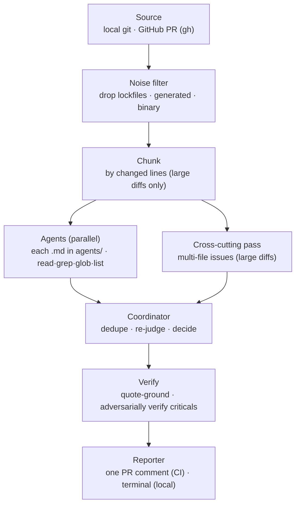

# @expo/code-review-cli

A config-driven, multi-agent AI code reviewer. Specialist agents review a diff in
parallel; a coordinator consolidates their findings into one structured review.
The same engine runs locally (advisory) and in CI (posts one PR comment). The CLI
is the **engine** — each repo supplies its own agents and settings under
`.expo-code-review/`, so behavior is configured per-repo, not baked in.

> **Status: experimental.** Comment-only and non-blocking — it never blocks a merge
> and never auto-approves. See [`ROADMAP.md`](./ROADMAP.md).

Inspired in part by Cloudflare's [_How we built our AI code review bot_](https://blog.cloudflare.com/ai-code-review/).



## Usage

Run via `npx @expo/code-review-cli <command>` (or the `ecr` / `expo-code-review`
binary once installed). On a repo that already has `.expo-code-review/` set up,
getting model credentials for local runs is one command:

```bash
npx @expo/code-review-cli setup-auth
```

Reviewing a PR (`--pr`/`ci`) needs the GitHub CLI — `brew install gh && gh auth login`.
Everything else the reviewer needs (including the `opencode` runtime) ships with the
package.

### First-time setup

```bash
# 1. Scaffold .expo-code-review/ + a CI workflow (--no-workflow to skip)
npx @expo/code-review-cli init
# 2. Get model credentials — guided; prints the export lines for your shell config
npx @expo/code-review-cli setup-auth
# 3. Verify env, config, and credentials
npx @expo/code-review-cli doctor
```

`setup-auth` reads the repo's config and walks through each credential it needs.
The scaffolded default is **Anthropic via the Claude Code CLI**: locally your
`claude` login is enough, and for CI it helps you mint a token with
`claude setup-token`. It also handles the alternatives (an OpenAI **API key**,
a **ChatGPT/Codex subscription** sign-in). `doctor` offers to run it whenever a
credential is missing.

In CI, store the credential as the repo secret the scaffolded workflow forwards
(`CLAUDE_CODE_REVIEW_SHARED_API_TOKEN` by default — an `sk-ant-oat…` token from
`claude setup-token`, or an `sk-ant-api…` Console key; the CLI reads either).

Prefer **OpenAI** (API key, or a ChatGPT/Codex subscription, or both mixed) or
another provider? See [Other providers & auth modes](#other-providers) below.

### Reviewing (already configured)

```bash
# Review working-tree changes; prints here, posts nothing
ecr review
# Review a GitHub PR by number (preview only)
ecr review --pr 123
# …and post it as the PR comment
ecr review --pr 123 --post
# Preview once, save the exact result, and post it later without another model run
ecr review --repo owner/repo --pr 123 --save-review --json
ecr post-review --artifact .expo-code-review/.runs/deferred/<artifact>.json --repo owner/repo --pr 123
```

Options (most to least common):

| Flag | What it does |
| --- | --- |
| `--pr <n>` | Review GitHub PR #n by number (diff fetched via `gh`, no checkout); not combinable with `--base`/`--head`/`--staged`. |
| `--post` | With `--pr`, also post the result as the PR comment (needs `gh` auth). Omit to preview only; re-run with `--post` to publish. |
| `--save-review` | With explicit `--repo` + `--pr`, save the exact preview as a private postable artifact. Mutually exclusive with `--post`. |
| `--staged` | Review only staged changes (index vs HEAD; not combinable with `--base`/`--head`). |
| `--base <ref>` | Base ref to diff against (default: merge-base with the default branch). |
| `--head <ref>` | Head ref to diff (default: working tree, incl. uncommitted changes). |
| `--agents <a,b>` | Run only these agents (comma-separated ids); default: all. |
| `--route` | Let an LLM router pick the relevant agents from the diff. |
| `--repo <owner/repo>` | Repo for `--pr` (default: inferred from the current checkout). |
| `--json` | Emit machine-readable JSON on stdout. |
| `--no-fail` | Always exit 0 (otherwise a `request_changes` decision exits non-zero). |
| `-h`, `--help` | Show help. |

`--pr` uses the PR's diff (authoritative) and checks the PR head out into a
throwaway worktree so the agents' surrounding-source reads and the verifier see the
PR's versions of files — no manual `gh pr checkout` needed, and your working tree is
left untouched. (If that materialization can't run — e.g. not a git checkout — it
falls back to reading the current working directory.)

In CI it runs automatically from the scaffolded workflows — by label or a `/review`
comment (see **CI usage**). From Claude Code (or another agent), add a slash command
that runs it; eas-cli's
[`/expo-review`](https://github.com/expo/eas-cli/blob/main/.claude/commands/expo-review.md)
is a ready example to adapt.

### Command reference

| Command | What it does |
| --- | --- |
| `ecr init [--no-workflow] [--force]` | Scaffold `.expo-code-review/` (config, agents, prompts) + a CI workflow. |
| `ecr init --monorepo` | …and add a `routing.jsonc` routing manifest (one default scope). |
| `ecr init --scope <dir>` | Scaffold a per-team scope under `<dir>` and register it in the manifest. |
| `ecr setup-auth [--yes]` | Walk through getting model credentials for local runs (ChatGPT/Claude sign-in and/or API keys), printing the `export` lines for your shell config. |
| `ecr review [options]` | Review local changes and print an advisory review (default command). |
| `ecr review --scope <name>` | Review only one routing scope over just that scope's changed files. |
| `ecr post-review --artifact <path> --repo <owner/repo> --pr <n>` | Post an exact saved PR preview without re-running models; refuses target, head, config, or break-glass drift. |
| `ecr ci` | Review the current GitHub PR and post/update a comment. For GitHub Actions. |
| `ecr doctor [--list-scopes]` | Check environment, config, credentials, and (with a manifest) scopes. |
| `ecr feedback [--repo <owner/repo>]` | Report which findings PR authors pushed back on, across history. See below. |
| `ecr ref-check [--json]` | Fail when the review setup cites code that moved or vanished. See below. |

Extra flags for monorepos: `review`/`ci` `--config-dir <dir>` (load config from an
alternate dir; also `ECR_CONFIG_DIR`), `ci --scopes a,b` (limit the fan-out to
named scopes), `ci --comment single|per-scope` (override the manifest). Both
`review` and `ci` also take `--context-file <path>` (inject a file's text as
untrusted external context; see below).

(When developing this repo itself, use `bun run src/cli.ts <command>`.)

---

## Keeping prompts true (`ecr ref-check`)

Good reviewer prompts cite real code: "the only session entry point is
`server/src/session.ts`", "every webhook router must call `sanitizeSecrets`". Then the
code moves and the prompt keeps citing a path that no longer exists — the reviewer
reasons from a fiction, on every PR, with nothing to warn you.

`ecr ref-check` makes those citations checkable. Pin each one with a ref, in a comment
of its own (`<!-- … -->` in Markdown, `//` in JSONC):

```md
<!-- @ref server/src/session.ts#createSession — the only place a session is minted -->
<!-- @ref server/src/entities/oauth/ — every provider lives here -->
<!-- @ref glob:**/*WebhookRouter.ts — the routers this rule is about -->
```

A target is a file, a `dir/`, `glob:<pattern>`, `file#symbol`, or `doc.md#heading` —
never a line number, since a line number rots without any signal. Symbol anchors are
checked by whole-word match, so code moving inside its file is fine and a rename is not.

The check is strict on purpose: a backticked token in `.expo-code-review/` that looks
like a repo path **must** be a ref, because the stale citations are exactly the ones
nobody thought to annotate. A token with no extension (`eas-build-worker/terraform`,
`general-central/{module,production}`, `finops`) counts when it names something that
exists — so those get pinned too, while `anthropic/claude-opus-5`, shaped the same way,
stays prose. For a token that only looks like a path, say so once:
`<!-- @ref-ignore knex.raw() -->`. It also checks what your config already declares —
`enforceAgents` ids, scope `config` directories, scope path globs.

Refs are repo-root-relative, including in a scope's own setup dir. A scope prompt that
cites `general-central/module` for `infrastructure/general-central/module` gets told the
root-relative form to use.

Two run points:

- `ecr ref-check` exits 1 on any problem. Run it in CI or a pre-commit hook.
- `ecr review` / `ecr ci` run it too, and never fail a PR's checks with it. The comment
  carries a **Review setup** note instead: refs that no longer resolve, plus cited code
  *this PR* changes, where the ref still resolves but the guidance may not.

---

## Providing context and research capabilities

`@expo/code-review-cli` includes `review-research-mcp` and exposes that one bundled,
local MCP directly to reviewer and cross-file passes. The agent decides whether an
external API contract needs research and can either search for an exact symbol or
fetch an exact supported documentation URL already present in the review context.
Coordinator, verifier, stack-verifier, and time-critical no-tools passes never receive
the MCP.

Enable it only in the root config, which CI loads from the PR's trusted base:

```jsonc
{
  "research": {
    "enabled": true,
    "maxQueries": 8,
    "resultsPerQuery": 2,
    "timeoutMs": 30000
  }
}
```

Add a repository Actions secret named `BRAVE_SEARCH_API_KEY`. The generated
automatic and command-triggered workflows pass only that search credential to the
MCP. Expo uses its public documentation search and OkHttp uses its official static
search index; neither consumes Brave quota.

ECR resolves the MCP entry point inside its own installed package and starts it with
the current absolute Node executable, so a PR-owned `PATH` entry cannot replace
either component. Each review gets an owner-only temporary MCP config and append-only
audit. Claude receives that explicit config under `--strict-mcp-config`, with project
settings and slash commands disabled; OpenCode receives the same fixed local command.

That command is a wrapper, not the server. Both engines merge a configured MCP `env`
onto their own environment instead of replacing it, so the declared block alone cannot
bound the child — the engine's model credential reaches it, and OpenCode additionally
passes down the runner's whole ambient environment. The wrapper therefore rebuilds the
environment from an explicit allowlist before starting the server, and loads no parser
and opens no socket of its own. The server process sees the search key, the call
bounds, and locale/proxy settings; it never sees a model credential. The Brave
credential travels the same way and is never added to the model process env.

The MCP bounds the shape, host, and volume of outbound requests. It is not a
confidentiality boundary: the reviewing model chooses the query terms and URLs, and a
low-entropy identifier can carry repository-derived data past every check below.
Enable research only where repository-derived terms may be shared with Brave and the
documentation providers. Search queries are normalized before
logging or networking: quoted literals, URLs, email addresses, paths, prose stop
words, overlong/high-entropy tokens, and unsupported punctuation are removed;
credential-shaped or secret-labeled input fails closed. The remaining query must be at
most eight short tokens and either contain an API-like symbol or be a short multi-word
lowercase concept phrase. Direct URLs must use plain
HTTPS with no credentials, port, query string, or fragment; suspicious/high-entropy
path segments fail closed. The fixed provider host/path allowlist and redirect,
response-size, content-type, and timeout checks still apply after that first gate.
These deterministic checks greatly reduce accidental exfiltration; they are not a
proof that every low-entropy string is harmless, so reviewer prompts also forbid
sending repository text and the review-wide MCP budget defaults to eight calls.

`maxQueries` bounds MCP calls, not network requests. One search selects up to four
providers, and each issues its own discovery request plus a page fetch per candidate,
so eight calls can mean roughly thirty discovery requests and over a hundred page
downloads. Every call therefore reports its own ledger — discovery requests, page
fetches, redirect hops, total HTTP requests, and elapsed time — and the review log and
Actions summary report the totals. `timeoutMs` is the MCP's own end-to-end deadline for
one call, enforced by the server across discovery, redirects, retrieval, and
extraction; a call that hits it returns what it already has rather than failing. It has
to live there because OpenCode's `timeout` bounds only tool discovery and Claude
provides no per-call timeout at all.

For non-Expo providers, discovery sends a fixed, provider-owned `site:` scope plus
the bounded query to Brave's fixed Web Search endpoint. Search snippets and titles
are never treated as evidence. ECR independently rejects off-allowlist result URLs,
manually validates every redirect, fetches a few official pages, verifies content
types and response sizes, extracts visible documentation text, and returns locally
ranked bounded passages. Sparse search-engine coverage therefore produces an honest
empty result rather than a loose guess.

Research is root-only in routed monorepos because it starts a host process; scope
configs cannot alter its network behavior or limits. Result-cache reuse remains
disabled while research is enabled because web results and documentation can change
without a config change.

The fixed provider catalog covers Apple/Android APIs plus SDWebImage, Media3, Glide, OkHttp,
Kotlin coroutines, Gradle/AGP, Swift concurrency/evolution, platform release/API
availability, Expo, React Native, Reanimated, Gesture Handler, Screens, and Worklets.
Queries are short exact symbols plus at most one useful member or behavior term. For
example, `CameraView barcodeScannerSettings` is useful; a source snippet, import path,
or natural-language question is not. The MCP publishes the same guidance in its tool
metadata. An empty result stays empty; it is not replaced with a loose semantic guess.
The tool metadata also includes an explicit provider map, so the reviewing model can
distinguish core platform APIs from release notes, dependency-owned documentation,
build-tool references, and issue-tracker context before choosing a corpus.
Reviewer instructions require grounding whenever a judgment depends on an externally
owned API contract, whether the evidence confirms a finding or dismisses a candidate
as safe; model memory alone is not treated as sufficient for those decisions.
Native source keeps its platform context: Apple or Android documents the OS contract,
while an explicit dependency provider documents library-owned behavior. Providers are
additive when both contracts matter. A path under `packages/expo-*` does not by itself
route Swift or Kotlin code to Expo's JavaScript documentation.

Direct clients can also call `fetch_platform_doc` with an exact documentation URL.
The tool infers the narrowest matching provider (or accepts an explicit provider
hint), then applies the same fixed HTTPS host/path allowlist, manual redirect checks,
10-second timeout, 5 MB response limit, content-type validation, extraction, and
passage bounds as search-discovered pages. It returns normalized extracted text, never
raw HTML or DocC JSON. An optional `query` selects context only within that one page;
it never broadens discovery. Context expands progressively:

- `focused` returns the best passage plus adjacent passages.
- `section` (the default) returns a contiguous window of at most 12,000 characters
  around the best passage.
- `document` returns at most 20,000 characters of extracted page text and should be
  used only when the contract is spread across the page.

The response reports returned and original character counts, whether it was truncated,
the anchor passage id, and bounded available passage ids. Search results also carry
neighboring passage ids so an agent can recognize when more local context exists. For example,
`https://developer.apple.com/documentation/swiftui/view/menustyle(_:)` is resolved to
Apple's DocC JSON and returned with the canonical page URL and API availability.

Every research-enabled review audits each sanitized outbound query and each returned result's
title, provider, provenance class, and canonical URL. GitHub Actions receives the
same audit trail in the step summary, while `.runs/reviews.jsonl` keeps the queries
plus bounded returned passages for short-lived operational inspection. Reviewers
are instructed to attach `sources` only when documentation materially supports a
finding. ECR accepts only exact URLs returned during that review, restores canonical
titles, carries citations through coordination, and renders them below the finding.
A citation to a URL this review never retrieved is dropped outright. Relatedness is a
separate, weaker guarantee: a cited finding is escalated to the verifier with the
audited passage inline, which judges whether that passage actually supports the claim
and strips the citation when it does not.

Reviewers also emit a bounded `researchDecisions` record only when documentation
materially confirms a finding candidate or proves one safe. ECR grounds those records
against the exact MCP audit and discards ungrounded claims. After verification and
suppression, the log and Actions summary report final findings with citations,
supported and dismissed candidates, and unique audited results materially used versus
unused. Counts use canonical URLs rather than passage count, so repeated hits do not
inflate usefulness.

For a query routed to the `expo` provider, `serve` POSTs the already-sanitized query
directly to Expo's public Algolia search endpoint and returns canonical
`docs.expo.dev` hits. The endpoint, application id, and browser-visible search-only
key are fixed in the package; redirects are rejected; response size, timeout, hit
count, and returned URL host are bounded.

OkHttp's newly migrated documentation is still sparse in Brave, so its provider
downloads the fixed official `lysine.dev` static search index, validates and indexes
it in memory once per MCP process, and rejects any entry outside the existing OkHttp
allowlist. Brave remains a fallback if that official index is unavailable.

An absolute `research.indexPath` remains available as an optional local fallback.
The MCP and its trusted updater ship with ECR: build that fallback from this
repository with `bun run research:update`, or from an installed package with
`review-research-mcp update`. This is operator/scheduled offline tooling, not a
step to run before each review. The built-in seed catalog lives in
`research/sources.json`; `seedUrls` are deterministic starting pages for the
bounded crawler, and extraction/indexing use no LLM. Installations requiring a fully
offline review can supply a separately built, verified index and omit the Brave key.
Installation-specific provider configuration is intentionally
deferred: when added, it should follow the trusted root-config model used for agents
without permitting PR-controlled URLs, commands, or executable parsers. Expo skills
are complementary, not another search corpus: their pinned procedural guidance can
later be supplied to review agents as separately labeled trusted context, while
documentation search continues to return citable API evidence. Dynamic skills or
instructions retrieved from documentation must never become executable reviewer
instructions.

## Monorepos (routing manifest)

A monorepo can route different subtrees to different reviewer rosters from a single
infra-owned manifest. There is still **one workflow, one `ecr ci` process** per PR:
it reads the changed files once, assigns each to exactly one scope, reviews each
active scope over only its files, and renders one comment. Because it is a single
writer in a single process there is no comment/check race and no locking.

```
your-monorepo/
  .expo-code-review/
    routing.jsonc          # the manifest — infra-owned, ordered scope list + locked defaults
    config.jsonc           # the default/root scope; the ONLY place auth/tokenEnv lives
    shared.md coordinator.md agents/
  apps/
    api/.expo-code-review/{config.jsonc(NO auth),coordinator.md,agents/}   # api team
    web/.expo-code-review/{config.jsonc(NO auth),coordinator.md,agents/}   # web team
  .github/workflows/expo-code-review.yml   # unchanged shape: one workflow, one `ecr ci`
```

```jsonc
// .expo-code-review/routing.jsonc
{
  // Central guardrails every scope inherits and CANNOT override.
  "defaults": {
    // The ONLY place auth/tokenEnv is honored (besides the root config.jsonc).
    "auth": { "providers": { "anthropic": { "tokenEnv": "CLAUDE_CODE_REVIEW_SHARED_API_TOKEN" } } },
    "enforceAgents": ["security"],            // always runs on every scope, roster or not
    "commentTag": "expo-ai-code-reviewer"     // per-scope markers derive from this
  },
  "comment": "single",   // "single" = one aggregated comment (default) | "per-scope"
  // Ordered; the LAST matching scope wins per changed file (CODEOWNERS discipline).
  "scopes": [
    { "name": "default",  "paths": ["**/*"],        "config": "." },
    { "name": "apps-api", "paths": ["apps/api/**"], "config": "apps/api" },
    { "name": "apps-web", "paths": ["apps/web/**"], "config": "apps/web" }
  ]
}
```

```jsonc
// apps/api/.expo-code-review/config.jsonc  (the api team owns this)
{
  // NO "auth" block — locked centrally; a tokenEnv here is rejected by loader + CI guard.
  "model": "anthropic/claude-sonnet-5",
  "policy": { "includeSuggestions": false },
  "noise":  { "additionalIgnores": ["apps/api/**/__generated__/**"] }
  // shared.md, coordinator.md, agents/*.md live beside this file — the api team's roster.
}
```

- **Path glob dialect** — `**` crosses `/`, `*` matches within a segment. Keep a
  `**/*` catch-all scope so no changed file goes unreviewed (`ecr doctor` flags a
  coverage gap otherwise). Scopes are ordered and the **last** match wins, so put
  broad scopes first and specific ones after (CODEOWNERS/Renovate discipline).
- **Comment modes** — `single` posts one aggregated comment (a scope summary table
  + a collapsed `<details>` per scope) under the existing marker; `per-scope` posts
  one cleanly-namespaced comment per scope. A scope with zero matched files gets its
  stale comment deleted.
- **Scoped flags** — `ecr ci --scopes a,b` limits the fan-out; `ecr ci --comment
  single|per-scope` overrides the manifest; `ecr review --scope <name>` runs one
  scope locally; `ecr review`/`ecr ci --config-dir <dir>` (or `ECR_CONFIG_DIR`)
  load config from an alternate directory; `ecr doctor --list-scopes` prints the
  scope table. **`--config-dir` designates an alternate ROOT config dir: both
  `config.jsonc` and `routing.jsonc` are read from it, so the root config and its
  manifest always travel together. Scope `config` paths stay repo-root-relative —
  the override swaps the root config/manifest against the *real* scope tree, it
  does not relocate the scopes themselves.**
- **Passes budget** — `defaults`-level `budget` bounds total review time:
  `totalPassesMinutes` (default 55) is split across active scopes (which run
  sequentially in one `ecr ci`), clamped up to `minScopeMinutes` (default 5) so a
  single scope still gets a workable window. When enough scopes are active that the
  floor would overshoot the total, `ecr ci` keeps the floor but warns, and `ecr
  doctor` flags the worst case (`scopes × floor` vs total) — raise the workflow
  `timeout-minutes` or trim scopes.
- **Adoption is incremental** — with no `routing.jsonc`, behavior is exactly as
  before (single config). Add the manifest with just a default scope → still one
  comment, identical behavior. Land per-team scope dirs one at a time; everything
  else keeps hitting the default scope.

### Security

- **auth and research are locked to the root.** `tokenEnv` (which env var becomes the model
  credential) is honored in exactly one place: the root `config.jsonc` or
  `routing.jsonc` `defaults.auth`. A scope config declaring `auth`/`breakGlass`/`research`
  **fails to parse** (Zod-level rejection). A scope declaring `research` also fails,
  so PR-controlled routing cannot select a different host index. The CI guard step independently
  sweeps every `.expo-code-review/config.jsonc`/`routing.jsonc` repo-wide and refuses
  to run unless `tokenEnv` appears exactly once, in a root-owned file, equal to
  `ECR_EXPECTED_TOKEN_ENV`. A routing manifest can never widen exposure — globs only
  choose *which roster* reviews a file, never *which secret* is sent.
- **enforceAgents can't be weakened.** Agents listed in `defaults.enforceAgents`
  (e.g. `security`) are injected into every scope with `alwaysRun`, taken from the
  root roster — a scope defining a same-id agent gets the root one, so a team can't
  shadow the enforced reviewer with a weaker version on its own subtree.
- **Configuration comes from the PR's trusted base commit.** In `ecr ci`, review
  policy and reviewer configuration — `config.jsonc`, `routing.jsonc`, prompts,
  models, and the auth mapping — load from the PR's immutable **base** commit,
  materialized via the GitHub API. The PR head is untrusted data: it is
  materialized separately (pinned to its immutable OID) purely as source content
  to read and verify against. A PR editing rosters, prompts, or routing is
  reviewed under the **previous** config; its changes activate after merge. If
  the base commit can't be materialized, the run fails closed (one terminal
  comment) — it never falls back to the checkout. A scope config that is new in
  a PR is reviewed with the root config until it merges.
- **The model runtime never sees PR-owned ambient config.** The head worktree the
  agents read from is scrubbed of runtime configuration before the OpenCode
  server starts: `opencode.json{,c}`, `.opencode/` (plugins), `AGENTS.md`,
  `CLAUDE.md`, `.claude/`, `.mcp.json`, `.cursor*`, and `.env*` at every depth.
  A PR can't install a plugin, MCP server, instruction file, or `.env` into the
  process that holds the model credential and the comment token. (Changes to
  those files are still reviewed — their diffs are inlined in the prompt — but a
  finding citing one can't be re-read during verification; that's the tradeoff.)
- **The scaffolded workflows check out only the base commit** with
  `persist-credentials: false`; the CLI's own git fetches authenticate through
  `gh` from `GH_TOKEN`, so the token never lands in `.git/config` or argv. The
  CLI enforces the trust model itself, so a custom workflow that checks out the
  PR head still gets base-commit configuration. The temporary escape hatch
  `ecr ci --unsafe-config-from-head` restores the old behavior with a loud
  security warning and will be removed on a minor boundary.

Ownership is enforced with CODEOWNERS: `/.expo-code-review/routing.jsonc @your-infra`
(the single authoritative router) and `/apps/api/.expo-code-review/ @your-api-team`
(each team owns only its own scope dir). Rerouting globs is gated behind infra review.

---

<details>
<summary><b>How it works</b></summary>

- **Source** — local git (working tree, staged, or a ref range) or a GitHub PR
  (diff + metadata fetched over the `gh` API).
- **Noise filter** — drops lockfiles, generated bundles/maps, snapshots, files
  matching the repo's `additionalIgnores`, and binary files (no textual diff to
  review). Filtered files are recorded, not silently dropped.
- **Chunking** — small PRs run in a single pass; large PRs are split into chunks
  bounded by changed lines, plus one combined **cross-cutting pass** that looks
  for issues spanning multiple changed files across every agent's concern.
- **Agents** — every `.md` file in `.expo-code-review/agents/` is an agent. They
  run in parallel with read-only repo tools (`read`/`grep`/`glob`/`list`).
- **Coordinator** — a single pass that dedupes, re-judges severity, and produces
  the final `{ decision, findings, summary }`.
- **Verify** — quote-grounds every finding against the real file and adversarially
  verifies criticals, so a confident-but-wrong finding doesn't ship.
- **Reporter** — posts/updates a single fingerprinted PR comment (CI), or prints
  a grouped summary (local). Findings below the configured severity floor are
  suppressed.
- **Whole-review reuse** — automated CI stores a hash of each review job's inputs
  in the hidden state of that comment. If a restack leaves a scope's files and
  review configuration unchanged, its complete prior result is reused. Manual
  `/review`, partial/failed reviews, stack-aware review, and model-adjudicated
  feedback always run fresh.

Built on the [OpenCode](https://opencode.ai) SDK, which spawns the model provider
and applies the provider's prompt caching automatically.

</details>

<details>
<summary><b>Tokens, cost &amp; prompt caching</b></summary>

Every run reports what it spent and how much of it was served from the prompt
cache, in three places:

- **Job log (stderr)** — one line at the end of the run:
  `Token usage — input …, output …, cache read …, cache write … (cost $…)`.
- **GitHub Actions step summary** — a per-pass table (one row per agent, plus the
  cross-cutting pass, coordinator, and verifier), the run's cache hit rate, and
  the exact comment that was posted. The PR comment is updated in place on every
  run, so the step summary is where past runs' comments remain readable.
- **`.expo-code-review/.runs/reviews.jsonl`** — one JSON line per run (uploaded as
  a CI artifact) with the same totals plus per-pass `agentTokens`, the raw
  per-agent findings, bounded reviewer traces, coverage notes, and what the verifier
  dropped.

Each reviewer can also return a compact trace with up to three concrete checks and
two unresolved questions. The reporter stores it only inside the existing base64
`<!-- <commentTag>:state=… -->` comment marker as `review.reviewTrace`; it does not
render in the visible review. Agents and other machine consumers can decode that
state to see what a clean review covered. The payload declares
`trust: "unverified-model-diagnostics"`: it contains bounded conclusions, never a
raw transcript or chain-of-thought, and must not be treated as a verified finding.
The engine sorts agent ids and caps the complete decoded trace at 6 KB so this hidden
diagnostic cannot crowd visible findings out of GitHub's comment-size limit.

**How the caching works.** Provider prompt caching is a *prefix match*: the
provider caches the rendered prompt up to a point, and any byte change anywhere
in that prefix invalidates everything after it. The reviewer is laid out so the
prefix is stable — the system prompt (`shared.md` + the agent's own `.md`) is
byte-identical for every chunk an agent reviews, while the volatile parts (the
diff, file lists, PR metadata) travel in the user message *after* the prefix and
never touch it. OpenAI caches automatically (no write premium; cached input is
billed at a steep discount and shows up as `cache read`); Anthropic charges a
small premium to **write** the cache (~1.25× input) and ~0.1× input to **read**
it. Entries live minutes, refreshed on use — comfortably covering a run's
concurrent calls.

**Reading the numbers.** Hit rate = `cache read / (cache read + input)` — the
share of prompt tokens served from cache instead of being reprocessed at full
price. Multi-chunk reviews should show a high rate; single-chunk reviews mostly
show writes (there is nothing to re-read within the run).

**Keeping hits high:**

- Keep `shared.md` and `agents/*.md` stable. Any edit writes a new prefix — one
  extra cache write per agent on the next run, then it is warm again. Never put
  varying text (dates, PR numbers) into prompt files.
- Very short prompts may show `cache read 0`: prompts below the model's minimum
  cacheable size (~1–4K tokens depending on the model) are silently not cached.
  That is expected, not a bug.

</details>

<details>
<summary><b>Configuration — <code>.expo-code-review/</code></b></summary>

```
.expo-code-review/
  config.jsonc        # model, policy, noise, auth, break-glass, comment tag
  shared.md           # instructions prepended to every agent (optional)
  coordinator.md      # the consolidation prompt (required)
  agents/
    correctness.md    # each .md here is an agent (id = filename)
    security.md
    consistency.md
```

`shared.md` and `coordinator.md` are reserved names; every other `.md` in
`agents/` becomes an agent. Per-agent overrides go in each file's frontmatter:

```markdown
---
description: One line the router uses to decide relevance.
alwaysRun: true        # run even when the router would skip this agent
model: anthropic/claude-opus-5   # override the default model
temperature: 0.1
---

# Agent instructions in Markdown…
```

For a real-world example, see eas-cli's
[`.expo-code-review/`](https://github.com/expo/eas-cli/tree/main/.expo-code-review)
— correctness/security/consistency agents, a stronger model for security, and
per-repo `noise.additionalIgnores`.

`config.jsonc` (JSONC — comments + trailing commas supported):

```jsonc
{
  "model": "anthropic/claude-sonnet-5",       // default model for the specialists
  "policy": { "includeSuggestions": false },  // suppress suggestion-severity findings
  "chunk": { "maxChangedLines": 1000, "maxFiles": 20 },  // concurrency defaults: 6 (API key) / 3 (subscription)
  "noise": { "additionalIgnores": ["packages/*/build/**"] },
  "review": { "trigger": "all",               // which PRs `ecr ci` reviews: "all"
              "label": "ai-review",            // (default, except ai-review:skip) or
              "skipLabel": "ai-review:skip" }, // "label" (only labeled PRs)
  "breakGlass": { "marker": "/skip-review" }, // PR body marker that skips the review
  "commentTag": "expo-ai-code-reviewer",      // hidden tag used to find/update the comment
  "auth": { "providers": {
    "anthropic": { "tokenEnv": "CLAUDE_CODE_REVIEW_SHARED_API_TOKEN" } } }
}
```

</details>

<details>
<summary><b>Model selection</b></summary>

Precedence: **`REVIEWER_MODEL` env** (global override) → per-file **frontmatter
`model:`** → **`config.jsonc` `model`** (the default). So a repo can run a mixed
setup, and a developer can override everything locally.

- **Specialist agents** (correctness/security/consistency) benefit from a
  reasoning-tier model — **`anthropic/claude-sonnet-5`** is the quality/speed
  sweet spot (the scaffolded default). The **Opus tier** finds more but is slower
  and more expensive, so scope it to the highest-stakes agent: **security runs on
  `anthropic/claude-opus-5`** (set in `security.md` frontmatter), the rest on the
  default.
- **The coordinator** makes the final call (dedupe / re-judge / decide) — worth a
  strong model; the scaffold pins it to `anthropic/claude-opus-5` in
  `coordinator.md` frontmatter.
- If latency/timeouts dominate on big PRs, moving the specialists to a faster model
  (e.g. `anthropic/claude-haiku-4-5`) is the most direct lever (a real recall
  tradeoff — measure it).
- **Every run logs which model actually answered each pass** — in the job log
  (`Models used — …`), the Actions step summary table, and the run log's
  `agentModels` — and warns loudly if a pass ran on a different model than
  configured, so a provider-side substitution can never pass unnoticed.

There is no automatic cross-provider "equivalent" fallback — that would silently
change which model reviewed your code. Use an explicit override instead.

</details>

<details>
<summary><b>Reliability</b> — never hangs, never silently drops work</summary>

- **Per-task time caps** — chunk passes 15 min; coordinator 10 min. A global passes
  budget (55 min) bounds all passes incl. the subdivision waves, fitting inside the
  CI job's `timeout-minutes` (90).
- **The cross-file pass is elastic** — it gets whatever is left of the passes budget
  rather than a fixed cap, because it's the one pass whose scope can't be traded for
  convergence: halving its file set deletes exactly the coverage it exists for. Chunk
  passes run alongside it under their own caps, so a long cross-file pass doesn't
  starve them.
- **Tool-call cap** — a pass that makes too many `read`/`grep` calls without
  finishing is *wandering*, not converging; hitting the cap trips the soft landing.
  The cross-file ceiling scales with the diff's file count (its diffs are inlined, so
  tool calls go to *tracing*, not fetching).
- **Stall detection** — a pass whose reply stops changing entirely (no new tool call,
  no streamed text or reasoning, no token growth) has a wedged model request, not a
  hard problem. After 4 min of silence it's abandoned and retried once from a clean
  session, inside the same budget — instead of spending the whole cap on a dead
  request. Progress lines say how long a reply has been silent, so this is legible in
  the CI log.
- **Rate limits are detected and waited out, not fought.** The reviewer watches the
  OpenCode server's own log for provider 429s (hard evidence, per run). A stall
  *with* recent 429 evidence is throttling, not a wedge — the pass waits in 90s
  beats (without consuming its one retry) instead of re-sending its whole context
  into a limited account; explicit 429 errors retry on a slow 15s/45s/90s schedule.
  Subscription (oauth) runs also default to `concurrency` 3 instead of 6, since one
  account may be serving several PRs' reviews at once. Rate-limit events are
  reported in the job log and the run log (`rateLimitEvents`), so throttling is a
  visible fact about a run, never a mystery slowdown.
- **Soft landing on timeout** — at either cap, the run is interrupted and the agent
  is asked to return the findings it already has, rather than discarding its work.
  Tools are disabled for that request, so the salvage step can't resume investigating
  instead of answering.
- **Subdivide-on-timeout** — a reviewer pass that times out with nothing to show has
  its chunk split in half and the halves re-reviewed (recursively, down to a single
  file), then a fast **no-tools fallback** over the inlined diff (the cross-file pass
  skips straight to the fallback, which still sees the whole diff). Only a genuinely
  un-reducible pass reports a coverage gap — and it is always reported, never silent.
- **Parse failures are retried** (same session, then once in a bounded fresh
  session) — separate from the timeout path.
- **Transient API errors are retried** (bounded backoff on 429/5xx/network) —
  distinct from both the timeout path (abandon) and the parse path; a one-off blip
  no longer drops an entire pass.
- **Auth failures surface once, and fail fast** — `ecr` checks the configured
  provider's credential at startup and stops with one clear message if it's missing
  (rather than failing every pass); a credential rejected mid-run (401/403)
  collapses into a single actionable coverage note pointing at
  `auth.tokenEnv`/`REVIEWER_MODEL`.
- **A failed run never reads as "Approve"** — all passes fail → "could not
  complete"; some fail → never a clean approve, and coverage-reduced.
- **The coordinator can't sink the run** — if consolidation fails, findings are
  merged deterministically and still posted.
- **Coverage notes** — passes that timed out/failed are listed (routine noise
  filtering is *not* flagged — it's expected and stays in the run log).
- **CI always gets a terminal state** — on any failure the PR gets a "didn't run"
  comment, not a stuck reaction and silence.

</details>

<details>
<summary><b>CI usage</b></summary>

`ecr init --with-workflow` scaffolds a `pull_request` workflow. Split along a clean
line: **comments = one-shot actions, labels = persistent configuration.**

- **command workflow** — one-shot `/review` comments (maintainers): `/review`
  (router picks agents), `/review all`, `/review correctness security`. Never
  changes configuration.
- **auto workflow** — continuous review. **Which PRs get reviewed is set in
  `config.jsonc` → `review.trigger`**: `"all"` (default) reviews every PR except
  those labeled `ai-review:skip`; `"label"` reviews only PRs labeled `ai-review`
  (or `ai-review:<agent>` to scope agents). `ecr ci` self-gates on this policy;
  the workflow's `if:` is an optional coarse gate layered on top. `ai-review:skip`
  always wins and is write-gated, so a contributor can't opt their own PR out.
- **dismiss workflow** — `/dismiss <id> [… -- reason]` / `/undismiss <id>`
  (maintainers). Each finding shows a short `` `id:…` ``. Dismissal is a **display
  filter only** — the reviewer still analyzes everything, and a `critical`/`secrets`
  finding can never be hidden. (An inline `expo-code-review-ignore` comment on/above
  a line does the same, with the same critical/secrets carve-out.)

These workflows are comment-only (they never fail the PR's checks). The engine runs
as the published package via `npx`, so no PR-controlled code is built.

</details>

<details>
<summary><b>Author feedback (replies to findings)</b></summary>

A PR author's reply to a finding is matched to it deterministically — by quoting
the finding's title back, or by citing its short `` `id:…` `` token (only the id can
clear a finding, see below) — and recorded
in the comment's embedded state, no model involved in the matching itself. A
matched finding shows `💬 @login replied` (linked to the comment) and a visible
count above the fold; the reply's own text is never stored or rendered, only the
login, the comment link, and (optionally) an enum-valued verdict. Controlled by
the root-only `feedback` block in `config.jsonc`:

```jsonc
"feedback": {
  "mode": "annotate",       // "off" | "annotate" | "adjudicate"
  "match": "both",          // "quote" | "id" | "both"
  "dismiss": "never",       // "never" | "maintainers" | "adjudicated"
  "protectedCategories": ["secrets", "security"],
  "maxAdjudications": 10    // cap on model calls per run, when mode is "adjudicate"
}
```

- **`annotate`** (the default) matches and shows "author replied" with zero effect
  on the decision — safe and useful even if you never touch this block.
- **Clearing a finding always needs the `` `id:…` `` token**, in the replier's own words
  (an id inside a `>` quote does not count). Quoting the title is enough to *annotate*,
  never to clear: GitHub's "Quote reply" copies the PR author's text verbatim, so a
  maintainer clicking it would otherwise dismiss a finding on words the author wrote —
  by accident, or because they were led to.
- **`adjudicate`** additionally has a model re-check the reply against the actual
  source (distrust-by-default, like the finding verifier) and record a verdict.
  Whether that verdict can actually clear a finding is a separate, still-off-by-
  default choice — `mode` and `dismiss` are independent axes: `dismiss:
  "maintainers"` lets a maintainer's own reply dismiss with no model involved
  (it works under plain `annotate` too); `dismiss: "adjudicated"` additionally
  accepts an author reply the model confirmed (which does need `mode:
  "adjudicate"` for verdicts to exist). Either way the reply has to cite the finding's
  `` `id:…` ``. A `critical` finding, or one categorized `secrets`/
  `security`, can never be cleared this way, whatever the config — that floor is
  enforced in code, not the prompt.
- **`/undismiss <id>` wins over a reply.** Running it on a finding a reply cleared
  puts the finding back in the active list and keeps it there: another reply from
  the PR author can't clear it again. The restore is recorded against the FINDING
  in the comment state, not against the reply, so editing or deleting the reply
  doesn't drop it either. Only a maintainer lifts that — either `/dismiss <id>` on
  the same finding, or a maintainer's own reply to it.

`ecr feedback` mines this substrate retroactively, with no model call and no
re-review: it crawls a repo's PRs, reads each one's existing reviewer comment
(which already embeds its findings), matches non-bot replies against it, and
reports totals, a reply-rate, breakdowns by category/severity/agent, and — the
highest-value part — "repeat offenders": findings whose title recurred across 2+
PRs and drew a reply every single time.

```bash
ecr feedback --repo your-org/your-repo --limit 100 --since 2026-06-01
ecr feedback --as my-review-bot   # if CI posts under a PAT/app identity
ecr feedback --json               # for scripting
```

The crawl matches the reviewer's comments by author. CI posts them as
`github-actions[bot]` (the default), so a locally-run crawl uses that identity —
pass `--as <login>` when your workflow posts under something else.

`ecr feedback` always reads `.expo-code-review/config.jsonc` from the LOCAL
checkout, even with `--repo`. If `--repo` points at a different repo, it warns
that `commentTag` may not match, so a zero-findings result there is not read as
zero pushback. It also warns when every scanned PR had no bot comment at all,
instead of leaving that as an easy-to-miss "0 with a bot comment" in the totals.

See [LLP 0011](./llp/0011-author-feedback.explainer.md) for why matching is
deterministic, why reply text is never echoed into the comment, and why the
defaults are asymmetric.

</details>

<details>
<summary><b>External context (--context-file)</b></summary>

`ecr review --context-file <path>` and `ecr ci --context-file <path>` inject the
file's UTF-8 text into the reviewer prompts as an explicitly UNTRUSTED external
block (the reviewer is told to use it but never follow instructions in it). The
main use is a CI-provided terraform plan. The text is sanitized like any untrusted
prose and capped at 24k chars (head 16k + tail 8k, so a big plan keeps both its
resource list and its `Plan: N to add…` summary); the read itself is bounded at
1 MiB.

Read errors differ by command on purpose. `ecr review` fails loud (exits 2) on a
missing or oversized file, since you typed the path. `ecr ci` warns and continues
with no context, because a CI run must never fail the PR's checks.

### Atlantis terraform plans

`templates/atlantis.yml` is an opt-in workflow (not scaffolded by `ecr init`) that
runs the reviewer when Atlantis posts a `terraform plan` comment on a PR and feeds
the plan into the review as `--context-file`. The plan comment body is treated as
untrusted data throughout. Copy it into `.github/workflows/` and set two repo
variables: `ATLANTIS_BOT_LOGIN` (the Atlantis bot's comment login, e.g.
`atlantis-app[bot]`) and optionally `ATLANTIS_PLAN_MARKER`.

</details>

<details>
<summary><b>Run logs</b></summary>

Each run appends a JSON line to `.expo-code-review/.runs/reviews.jsonl` with the
inputs, decision, finding count, duration, per-agent cost, and aggregate token
usage (incl. prompt-cache read/write counts) — for auditing and measuring
cost/latency/cache reuse over time. It also records the same bounded `reviewTrace`
that the PR comment embeds for machine consumers. The same totals are printed as a
one-line summary to the terminal / CI job log at the end of each run, so cache reuse
is visible even in CI (where the run log is ephemeral).

`ecr review --save-review` additionally writes a versioned artifact under
`.expo-code-review/.runs/deferred/` with owner-only permissions. It contains the
verified final review and bounded feedback metadata, but no credential. `ecr
post-review` schema-validates it and refuses to post if its explicit repo/PR, live
head commit, or local comment-policy fingerprint no longer matches.

</details>

<a id="other-providers"></a>
<details>
<summary><b>Other providers & auth modes</b></summary>

The scaffolded default is **Anthropic via the Claude Code CLI** — see First-time
setup above and the Anthropic bullet below for how it authenticates and is
sandboxed. Everything is set in `config.auth`; non-anthropic providers get their
credentials through OpenCode.

- **Anthropic / Claude (the default)** — use `anthropic/...` model ids and every
  anthropic pass runs through the **Claude Code CLI** (`claude -p
  --output-format stream-json --verbose`), inferred from the model. The
  credential is (in order) a `tokenEnv` you name, an ambient
  `CLAUDE_CODE_OAUTH_TOKEN`, or your local
  `claude` login — an `auth` entry is entirely optional. Run `claude setup-token`
  for a Max/Team subscription token or point `tokenEnv` at an Anthropic Console
  API key (`sk-ant-api…`, forwarded as `ANTHROPIC_API_KEY`); the CLI reads
  either. `ecr setup-auth` walks you through it. Each pass is trust-isolated and
  read-only: it runs with `--safe-mode` (no `CLAUDE.md`/hooks/MCP/plugins),
  `--strict-mcp-config`, `--permission-mode dontAsk`, and only the
  `Read`/`Grep`/`Glob` tools — never `Bash`/`Edit`/`Write`/`WebFetch`/`WebSearch`.
  The child env is an allowlist that omits ambient `ANTHROPIC_API_KEY`/`ANTHROPIC_AUTH_TOKEN`
  (only the configured credential is re-injected).
  ```jsonc
  // The scaffolded default. No anthropic entry at all falls back to your
  // `claude` login.
  "auth": { "providers": {
    "anthropic": { "tokenEnv": "CLAUDE_CODE_REVIEW_SHARED_API_TOKEN" }
  } }
  ```
- **OpenAI: ChatGPT/Codex subscription (OAuth) + usage-based API key — the
  recommended mix if you review with OpenAI.** OpenAI permits subscription auth
  in third-party tools, and OpenCode
  ships the plugin for it — so the reviewer runs its default models on the
  subscription (zero marginal cost) and reserves the metered key for pro-tier
  models the subscription doesn't offer (`gpt-5.5-pro` is subscription-excluded).
  Use the per-provider map form:

  ```jsonc
  "auth": { "providers": {
    "openai":     { "mode": "oauth",   "tokenEnv": "CODEX_OAUTH_ACCESS_TOKEN" },
    "openai-api": { "mode": "api-key", "tokenEnv": "OPENAI_API_KEY", "upstream": "openai" }
  } }
  ```

  `openai-api` is an alias the reviewer synthesizes in the OpenCode config
  (`upstream` names the SDK it's backed by): agents reference `openai-api/gpt-5.5-pro`
  in frontmatter while everything else stays on `openai/gpt-5.5`. Notes:

  - **The oauth `tokenEnv` holds the ACCESS token** from an `opencode auth login`
    ChatGPT sign-in (`ecr setup-auth` extracts it) — a plain bearer, valid for
    days, with no rotation involvement. Do **not** use the refresh token as a
    shared secret: refresh tokens are single-use (rotation), so a static copy is
    spent by its first use and the sign-in dies with it. Access tokens expire
    (~10 days observed), so CI secrets need periodic re-minting — see the
    token-rotator item in the [roadmap](./ROADMAP.md); `doctor` and the run
    preflight warn before expiry.
  - **The API key needs exactly two permissions** — a *Restricted* key with
    *Model capabilities*: **Responses → Request** and **Chat completions →
    Request**; everything else (including *List models*) stays None. Create it
    in a dedicated, budget-capped project. (`ecr setup-auth` prints these
    instructions too.)
  - **In CI**, set the `ECR_EXPECTED_TOKEN_ENV` repo variable to the
    comma-separated set of both env names
    (`CODEX_OAUTH_ACCESS_TOKEN,OPENAI_API_KEY`) and pass both secrets in the
    workflow.
  - **Auditability**: every pass logs which provider/model answered it (job log,
    step summary, run log), so the subscription/API split is visible per run.
    One caveat: OpenCode can't price alias models (they're config-declared), so
    pro passes report `$0` in the run log's cost column — token counts are
    correct, and the OpenAI project dashboard is the source of truth for spend.
- **Another provider** — the current path is the `REVIEWER_MODEL`
  env override: `opencode auth login` once (pick the provider), then run with
  e.g. `REVIEWER_MODEL=google/gemini-3-pro`. It overrides every agent's model
  and uses your OpenCode login, so no `auth` block is needed.

Engines are inferred **per agent** from that agent's resolved model alone: an
`anthropic/…` agent runs through the Claude Code CLI while other agents run through
OpenCode — in the SAME run. So an anthropic model may coexist with an `openai` (or
any other) OpenCode provider, and each agent's `model` selects its engine.
`REVIEWER_MODEL` still overrides every agent's model (and therefore every agent's
engine), converging the whole run onto one engine.

There is no shared fallback key; if a run fails for lack of credentials, log in
with `claude` (the default) or authenticate a provider in OpenCode. `ecr doctor`
diagnoses setup.

**Setup errors fail fast, with the fix in the message.** A bad credential or model id
would otherwise fail every pass identically — a run that spends its whole budget
rediscovering one fixable thing, then reports N coverage gaps. So before any pass runs:

- **The credential's shape is checked.** OpenCode refuses a malformed credential by
  dropping the provider entirely, which then surfaces as "model not found" for every
  model, with nothing pointing at the credential. A truncated value, surrounding
  whitespace, or a token that can't work for the configured `auth.mode` is rejected
  by name.
- **Configured model ids for OpenCode-routed providers are checked against the running
  server**, so a typo or an id the provider doesn't have is reported once, up front,
  with the close matches. `anthropic/…` (Claude Code) model ids aren't checked up
  front — Claude validates them per-request, so a typo there surfaces as a per-pass
  error instead.
- **`ecr doctor` reports the `opencode` version actually in use** and warns when a
  different one is first on your `PATH` — runs use the version this package pins.

</details>
