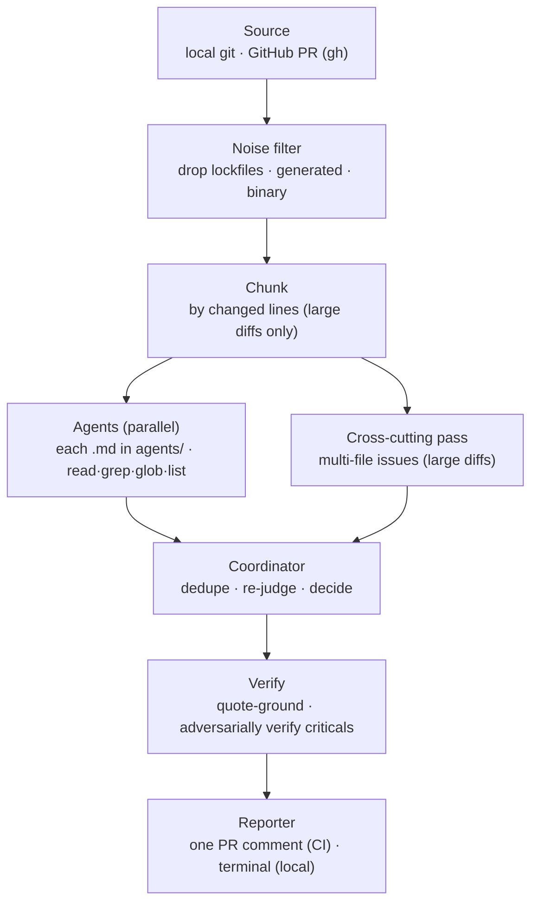

# @expo/code-review-cli

A config-driven, multi-agent AI code reviewer. Specialist agents review a diff in
parallel; a coordinator consolidates their findings into one structured review.
The same engine runs locally (advisory) and in CI (posts one PR comment). The CLI
is the **engine** — each repo supplies its own agents and settings under
`.expo-code-review/`, so behavior is configured per-repo, not baked in.

> **Status: experimental.** Comment-only and non-blocking — it never blocks a merge
> and never auto-approves. See [`ROADMAP.md`](./ROADMAP.md).

Inspired in part by Cloudflare's [_How we built our AI code review bot_](https://blog.cloudflare.com/ai-code-review/).

This README is the scannable overview. Every subsystem has a detailed design doc
under [`llp/`](./llp/) — start with
[LLP 0000](./llp/0000-expo-code-review-cli.explainer.md), the system map.



## Why not just `claude -p "review this diff"`?

A one-shot prompt in a workflow works — until the failure modes show up. The
engine exists for those:

- **Everything the reviewer reads is attacker-controlled.** The diff, the PR
  description, and the repo files are all input an outside contributor wrote —
  and a bare CLI run obeys instruction files from that same checkout
  (`CLAUDE.md`, `.mcp.json`, plugins) while holding the model credential and
  comment token. Here, configuration comes only from the trusted base commit,
  those files are scrubbed before the engine starts, and every pass is read-only
  ([details below](#the-security-gap-specifically)).
- **Confident-but-wrong findings post as-is.** Raw model output is the review.
  Here, every finding is quote-grounded against the real file and criticals are
  adversarially verified before anything is posted.
- **Failures read as silence or approval.** A one-shot call that stalls, gets
  rate-limited, or returns garbage either fails the job or posts nothing. Here,
  each failure class has its own bounded retry, a failed run never renders as a
  clean result, and CI always posts a terminal comment.
- **Big diffs blow the context window.** Large PRs are chunked with a separate
  cross-cutting pass for multi-file issues; specialist agents run in parallel; the
  prompt layout is cache-stable, and every run reports tokens, cost, and cache
  hit rate.
- **Noise wastes the model's attention.** Lockfiles, generated bundles, and
  binaries are filtered before the model sees them — recorded, never silently
  dropped.
- **Comment spam.** One fingerprinted comment updated in place, with `/dismiss`,
  severity floors, inline ignores, and author-reply tracking — not a new wall of
  text per push.
- **Review prompts rot.** `ecr ref-check` fails when a prompt cites code that
  moved or vanished, and every run warns loudly if a provider substituted a
  different model than configured.

### The security gap, specifically

A review bot is a process holding a model credential and a GitHub write token
that reads attacker-controlled input for a living. A bare `claude -p` workflow
typically checks out the PR head and hands the model broad tools — so a PR that
says the right words can run code, read secrets, or post as you. The trust model
here ([LLP 0001](./llp/0001-trust-model.principles.md)) is built around that:

- **No PR-controlled code is ever built or executed.** The engine runs as the
  published npm package via `npx`; the scaffolded workflows check out only the
  base commit, with `persist-credentials: false`.
- **The model has no write tools and no ambient web.** `Read`/`Grep`/`Glob` only
  — never `Bash`, `Edit`, or `WebFetch`. An injected instruction has nothing to
  act with; the worst it can do is produce a wrong finding, which then has to
  survive verification.
- **Review policy is not PR-editable.** Config, prompts, rosters, and the auth
  mapping load from the PR's immutable base commit; `tokenEnv` is honored in
  exactly one root-owned place, enforced at the schema level and again by an
  independent CI guard step.
- **Credentials are compartmentalized.** Child environments are allowlists that
  omit ambient keys; the research MCP never sees a model credential, the model
  process never sees the search key, and outbound research queries fail closed
  on credential-shaped input.
- **Untrusted text can't impersonate the reviewer.** PR prose travels inside
  sanitized boundary markers, and every `<!--` in it is escaped so a forged
  state marker can't hijack the dismissal list. `critical`/`secrets` findings
  can't be dismissed or cleared by replies — enforced in code, not the prompt.
- **The blast radius is capped by design.** The review is advisory and
  comment-only: even a fully fooled model can't approve, merge, or block
  anything.

## Usage

Run via `npx @expo/code-review-cli <command>` (or the `ecr` / `expo-code-review`
binary once installed). On a repo that already has `.expo-code-review/` set up,
getting model credentials for local runs is one command:

```bash
npx @expo/code-review-cli setup-auth
```

Reviewing a PR (`--pr`/`ci`) needs the GitHub CLI — `brew install gh && gh auth login`.
Everything else the reviewer needs (including the `opencode` runtime) ships with the
package.

### First-time setup

```bash
# 1. Scaffold .expo-code-review/ + a CI workflow (--no-workflow to skip)
npx @expo/code-review-cli init
# 2. Get model credentials — guided; prints the export lines for your shell config
npx @expo/code-review-cli setup-auth
# 3. Verify env, config, and credentials
npx @expo/code-review-cli doctor
```

`setup-auth` reads the repo's config and walks through each credential it needs.
The scaffolded default is **Anthropic via the Claude Code CLI**: locally your
`claude` login is enough, and for CI it helps you mint a token with
`claude setup-token`. It also handles the alternatives (an OpenAI **API key**,
a **ChatGPT/Codex subscription** sign-in, or a Meta Model API key for **Muse
Spark**). `doctor` offers to run it whenever a credential is missing.

In CI, store the credential as the repo secret the scaffolded workflow forwards
(`CLAUDE_CODE_REVIEW_SHARED_API_TOKEN` by default — an `sk-ant-oat…` token from
`claude setup-token`, or an `sk-ant-api…` Console key; the CLI reads either).

Prefer **Muse Spark**, **OpenAI** (API key, or a ChatGPT/Codex subscription, or
both mixed), or another provider? See [Other providers & auth modes](#other-providers)
below.

### Reviewing (already configured)

```bash
# Review working-tree changes; prints here, posts nothing
ecr review
# Review a GitHub PR by number (preview only)
ecr review --pr 123
# …and post it as the PR comment
ecr review --pr 123 --post
# Preview once, save the exact result, and post it later without another model run
ecr review --repo owner/repo --pr 123 --save-review --json
ecr post-review --artifact .expo-code-review/.runs/deferred/<artifact>.json --repo owner/repo --pr 123
```

Options (most to least common):

| Flag | What it does |
| --- | --- |
| `--pr <n>` | Review GitHub PR #n by number (diff fetched via `gh`, no checkout); not combinable with `--base`/`--head`/`--staged`. |
| `--post` | With `--pr`, also post the result as the PR comment (needs `gh` auth). Omit to preview only; re-run with `--post` to publish. |
| `--save-review` | With explicit `--repo` + `--pr`, save the exact preview as a private postable artifact. Mutually exclusive with `--post`. |
| `--staged` | Review only staged changes (index vs HEAD; not combinable with `--base`/`--head`). |
| `--base <ref>` | Base ref to diff against (default: merge-base with the default branch). |
| `--head <ref>` | Head ref to diff (default: working tree, incl. uncommitted changes). |
| `--agents <a,b>` | Run only these agents (comma-separated ids); default: all. |
| `--route` | Let an LLM router pick the relevant agents from the diff. |
| `--repo <owner/repo>` | Repo for `--pr` (default: inferred from the current checkout). |
| `--json` | Emit machine-readable JSON on stdout. |
| `--no-fail` | Always exit 0 (otherwise a `request_changes` decision exits non-zero). |
| `-h`, `--help` | Show help. |

`--pr` uses the PR's diff (authoritative) and checks the PR head out into a
throwaway worktree so the agents' surrounding-source reads and the verifier see the
PR's versions of files — no manual `gh pr checkout` needed, and your working tree is
left untouched. (If that materialization can't run — e.g. not a git checkout — it
falls back to reading the current working directory.)

In CI it runs automatically from the scaffolded workflows — by label or a `/review`
comment (see **CI usage**). From Claude Code (or another agent), add a slash command
that runs it; eas-cli's
[`/expo-review`](https://github.com/expo/eas-cli/blob/main/.claude/commands/expo-review.md)
is a ready example to adapt.

### Command reference

| Command | What it does |
| --- | --- |
| `ecr init [--no-workflow] [--force]` | Scaffold `.expo-code-review/` (config, agents, prompts) + a CI workflow. |
| `ecr init --monorepo` | …and add a `routing.jsonc` routing manifest (one default scope). |
| `ecr init --scope <dir>` | Scaffold a per-team scope under `<dir>` and register it in the manifest. |
| `ecr setup-auth [--yes]` | Walk through getting model credentials for local runs (ChatGPT/Claude sign-in and/or API keys), printing the `export` lines for your shell config. |
| `ecr review [options]` | Review local changes and print an advisory review (default command). |
| `ecr review --scope <name>` | Review only one routing scope over just that scope's changed files. |
| `ecr post-review --artifact <path> --repo <owner/repo> --pr <n>` | Post an exact saved PR preview without re-running models; refuses target, head, config, or break-glass drift. |
| `ecr ci` | Review the current GitHub PR and post/update a comment. For GitHub Actions. |
| `ecr doctor [--list-scopes]` | Check environment, config, credentials, and (with a manifest) scopes. |
| `ecr feedback [--repo <owner/repo>]` | Report which findings PR authors pushed back on, across history. See below. |
| `ecr ref-check [--json]` | Fail when the review setup cites code that moved or vanished. See below. |

Extra flags for monorepos: `review`/`ci` `--config-dir <dir>` (load config from an
alternate dir; also `ECR_CONFIG_DIR`), `ci --scopes a,b` (limit the fan-out to
named scopes), `ci --comment single|per-scope` (override the manifest). Both
`review` and `ci` also take `--context-file <path>` (inject a file's text as
untrusted external context; see below).

(When developing this repo itself, use `bun run src/cli.ts <command>`.)

---

## Keeping prompts true (`ecr ref-check`)

Good reviewer prompts cite real code ("every webhook router must call
`sanitizeSecrets`"). Then the code moves and the prompt keeps citing a path that no
longer exists — the reviewer reasons from a fiction on every PR. `ecr ref-check`
makes those citations checkable: pin each one with a `@ref` comment (`<!-- … -->` in
Markdown, `//` in JSONC):

```md
<!-- @ref server/src/session.ts#createSession — the only place a session is minted -->
<!-- @ref glob:**/*WebhookRouter.ts — the routers this rule is about -->
```

A target is a file, a `dir/`, `glob:<pattern>`, `file#symbol`, or `doc.md#heading` —
never a line number (line numbers rot without any signal). The check is strict on
purpose: any backticked token in `.expo-code-review/` that names something that
exists in the repo **must** be a ref, because stale citations are exactly the ones
nobody annotated. Mark the rare false positive once with
`<!-- @ref-ignore knex.raw() -->`. Refs are always repo-root-relative, including in
a scope's own setup dir, and config declarations (`enforceAgents` ids, scope
directories and globs) are checked too.

Two run points:

- `ecr ref-check` exits 1 on any problem. Run it in CI or a pre-commit hook.
- `ecr review` / `ecr ci` run it too but never fail a PR's checks with it — broken
  refs (and cited code *this PR* changes) surface as a **Review setup** note in the
  comment.

Full detail: [LLP 0012](./llp/0012-config-ref-integrity.explainer.md).

---

## Platform research (bundled MCP)

The package bundles `review-research-mcp`, a local MCP exposed only to the reviewer
and cross-file passes (never the coordinator, verifier, or no-tools passes). When a
judgment depends on an externally owned API contract, an agent can search a fixed
catalog of official documentation providers — Apple/Android platform APIs, Expo,
React Native, OkHttp, Kotlin coroutines, Gradle/AGP, Swift evolution, and more — or
fetch one exact supported documentation URL. Queries are short exact symbols
(`CameraView barcodeScannerSettings` is useful; a source snippet or a question is
not), and an empty result stays empty rather than becoming a loose guess. There is
no offline index: every passage is fetched live during that review.

Enable it only in the root config (CI loads it from the PR's trusted base) and add a
`BRAVE_SEARCH_API_KEY` Actions secret (Expo and OkHttp use their own official search
and consume no Brave quota):

```jsonc
{
  "research": { "enabled": true, "maxQueries": 8, "resultsPerQuery": 2, "timeoutMs": 30000 }
}
```

The boundary, in brief:

- **Bounded egress, not a confidentiality boundary.** Queries are normalized and
  sanitized (credential-shaped or secret-labeled input fails closed); direct URLs
  must be plain HTTPS on a fixed provider host/path allowlist; redirects, response
  sizes, content types, and per-call deadlines are enforced server-side. The model
  still chooses the query terms, so enable research only where repository-derived
  terms may be shared with Brave and the documentation providers.
- **The server never sees a model credential.** ECR starts the MCP from its own
  installed package through a wrapper that rebuilds the child environment from an
  explicit allowlist; the Brave key never enters the model process either.
- **Audited and citable.** Every outbound query and returned result is audited (job
  log, Actions step summary, `.runs/reviews.jsonl`). A finding can cite only URLs
  actually retrieved during that review, and the verifier strips citations whose
  passage does not support the claim.
- **`maxQueries` bounds MCP calls, not HTTP requests** — one search can fan out to
  many discovery and page fetches, so each call reports its own request ledger and
  the run reports totals.
- **Root-only in routed monorepos** (it starts a host process); scope configs
  cannot alter it. Research results are fetched and audited per run; cached review
  results remain keyed by the ordinary trusted review inputs and make no network call.

Full detail — providers, query grammar, `fetch_platform_doc` modes, provenance and
citation grounding: [LLP 0013](./llp/0013-platform-research.explainer.md).

## Monorepos (routing manifest)

A monorepo can route different subtrees to different reviewer rosters from a single
infra-owned manifest. There is still **one workflow, one `ecr ci` process** per PR:
it reads the changed files once, assigns each to exactly one scope (scopes are
ordered, the **last** match wins — CODEOWNERS discipline), reviews each active scope
over only its files, and renders one comment — a single writer, so no comment race
and no locking.

```
your-monorepo/
  .expo-code-review/
    routing.jsonc          # the manifest — infra-owned, ordered scope list + locked defaults
    config.jsonc           # the default/root scope; the ONLY place auth/tokenEnv lives
    shared.md coordinator.md agents/
  apps/
    api/.expo-code-review/{config.jsonc(NO auth),coordinator.md,agents/}   # api team
    web/.expo-code-review/{config.jsonc(NO auth),coordinator.md,agents/}   # web team
  .github/workflows/expo-code-review.yml   # unchanged shape: one workflow, one `ecr ci`
```

```jsonc
// .expo-code-review/routing.jsonc
{
  // Central guardrails every scope inherits and CANNOT override.
  "defaults": {
    // The ONLY place auth/tokenEnv is honored (besides the root config.jsonc).
    "auth": { "providers": { "anthropic": { "tokenEnv": "CLAUDE_CODE_REVIEW_SHARED_API_TOKEN" } } },
    "enforceAgents": ["security"],            // always runs on every scope, roster or not
    "commentTag": "expo-ai-code-reviewer"     // per-scope markers derive from this
  },
  "comment": "single",   // "single" = one aggregated comment (default) | "per-scope"
  // Ordered; the LAST matching scope wins per changed file (CODEOWNERS discipline).
  "scopes": [
    { "name": "default",  "paths": ["**/*"],        "config": "." },
    { "name": "apps-api", "paths": ["apps/api/**"], "config": "apps/api" },
    { "name": "apps-web", "paths": ["apps/web/**"], "config": "apps/web" }
  ]
}
```

```jsonc
// apps/api/.expo-code-review/config.jsonc  (the api team owns this)
{
  // NO "auth" block — locked centrally; a tokenEnv here is rejected by loader + CI guard.
  "model": "anthropic/claude-sonnet-5",
  "policy": { "includeSuggestions": false },
  "noise":  { "additionalIgnores": ["apps/api/**/__generated__/**"] }
  // shared.md, coordinator.md, agents/*.md live beside this file — the api team's roster.
}
```

- **Keep a `**/*` catch-all scope** so no changed file goes unreviewed (`ecr
  doctor` flags a coverage gap otherwise); broad scopes first, specific ones after.
- **Comment modes** — `single` posts one aggregated comment; `per-scope` posts one
  namespaced comment per scope. A scope with zero matched files gets its stale
  comment deleted.
- **Passes budget** — a `defaults`-level `budget` splits `totalPassesMinutes`
  (default 55) across the active scopes, floored at `minScopeMinutes` (default 5)
  per scope; `ecr ci` and `ecr doctor` warn when the floor can overshoot the total.
- **Scoped flags** — `ecr ci --scopes a,b`, `ecr ci --comment single|per-scope`,
  `ecr review --scope <name>`, `--config-dir <dir>` / `ECR_CONFIG_DIR` (alternate
  ROOT config+manifest dir — scope `config` paths stay repo-root-relative), and
  `ecr doctor --list-scopes`.
- **Adoption is incremental** — no `routing.jsonc` means exactly the old
  single-config behavior; a manifest with just a default scope is identical; land
  per-team scope dirs one at a time.

### Security

Enforced in code and by an independent CI guard step, not by convention:

- **auth and research are locked to the root.** `tokenEnv` is honored only in the
  root `config.jsonc` / `routing.jsonc` `defaults.auth`; a scope config declaring
  `auth`/`breakGlass`/`research` fails to parse, and the CI guard sweeps every
  config file repo-wide and refuses to run unless `tokenEnv` appears exactly once,
  root-owned, equal to `ECR_EXPECTED_TOKEN_ENV`. Routing globs choose *which
  roster* reviews a file, never *which secret* is sent.
- **enforceAgents can't be weakened.** Enforced agents (e.g. `security`) are
  injected into every scope from the ROOT roster with `alwaysRun`; a scope defining
  a same-id agent gets the root one.
- **Configuration comes from the PR's trusted base commit.** In `ecr ci`, all
  review configuration loads from the PR's immutable base; the head is untrusted
  content, materialized separately only to read and verify against. A PR editing
  rosters, prompts, or routing is reviewed under the **previous** config, and a
  missing base fails closed — never a fallback to the checkout. (Temporary escape
  hatch: `ecr ci --unsafe-config-from-head`, with a loud warning; to be removed.)
- **The model runtime never sees PR-owned ambient config.** The head worktree is
  scrubbed of `opencode.json{,c}`, `.opencode/`, `AGENTS.md`, `CLAUDE.md`,
  `.claude/`, `.mcp.json`, `.cursor*`, and `.env*` before the engine starts, so a
  PR can't install a plugin, MCP server, instruction file, or `.env` into the
  process holding the model credential and comment token.
- **The scaffolded workflows check out only the base commit** with
  `persist-credentials: false`; git fetches authenticate through `gh`, so the
  token never lands in `.git/config` or argv. The CLI enforces the trust model
  itself, so even a custom workflow that checks out the head still gets
  base-commit configuration.

Enforce ownership with CODEOWNERS: `/.expo-code-review/routing.jsonc @your-infra`,
`/apps/api/.expo-code-review/ @your-api-team`. Full detail:
[LLP 0006](./llp/0006-config-schema-loading-routing.explainer.md) (routing) and
[LLP 0001](./llp/0001-trust-model.principles.md) (trust model).

---

<details>
<summary><b>How it works</b></summary>

- **Source** — local git (working tree, staged, or a ref range) or a GitHub PR
  (diff + metadata fetched over the `gh` API).
- **Noise filter** — drops lockfiles, generated bundles/maps, snapshots, files
  matching the repo's `additionalIgnores`, and binary files (no textual diff to
  review). Filtered files are recorded, not silently dropped.
- **Chunking** — small PRs run in a single pass; large PRs are split into chunks
  bounded by changed lines, plus one combined **cross-cutting pass** that looks
  for issues spanning multiple changed files across every agent's concern.
- **Agents** — every `.md` file in `.expo-code-review/agents/` is an agent. They
  run in parallel with read-only repo tools (`read`/`grep`/`glob`/`list`).
- **Coordinator** — a single pass that dedupes, re-judges severity, and produces
  the final `{ decision, findings, summary }`.
- **Verify** — quote-grounds every finding against the real file and adversarially
  verifies criticals, so a confident-but-wrong finding doesn't ship.
- **Reporter** — posts/updates a single fingerprinted PR comment (CI), or prints
  a grouped summary (local). Findings below the configured severity floor are
  suppressed.
- **Whole-review reuse** — automated CI stores a hash of each review job's inputs
  in the hidden state of that comment. If a restack leaves a scope's files and
  review configuration unchanged, its complete prior result is reused. Manual
  `/review`, partial/failed reviews, stack-aware review, and model-adjudicated
  feedback always run fresh.

Built on the [OpenCode](https://opencode.ai) SDK, which spawns the model provider
and applies the provider's prompt caching automatically. Full detail:
[LLP 0002](./llp/0002-review-engine-pipeline.explainer.md) (pipeline) and
[LLP 0005](./llp/0005-verification-fingerprints-rendering.explainer.md)
(verification and rendering).

</details>

<details>
<summary><b>Tokens, cost &amp; prompt caching</b></summary>

Every run reports what it spent and how much was served from the prompt cache, in
three places: one `Token usage — …` line in the job log, a per-pass table + cache
hit rate in the GitHub Actions step summary (which also preserves each run's posted
comment, since the PR comment is updated in place), and one JSON line per run in
`.expo-code-review/.runs/reviews.jsonl` (uploaded as a CI artifact) with per-pass
tokens, raw per-agent findings, bounded reviewer traces, and coverage notes.

Each reviewer can also return a compact trace (up to three concrete checks and two
unresolved questions). It is stored only inside the hidden base64 comment marker as
`review.reviewTrace` — never rendered — declared
`trust: "unverified-model-diagnostics"`, and capped at 6 KB so it can't crowd
visible findings out of GitHub's comment-size limit.

**How the caching works.** Provider prompt caching is a *prefix match*: any byte
change in the prefix invalidates everything after it. The reviewer keeps the prefix
stable — the system prompt (`shared.md` + the agent's own `.md`) is byte-identical
for every chunk an agent reviews, while the volatile parts (diff, file lists, PR
metadata) travel after it. OpenAI caches automatically at a steep read discount;
Anthropic charges ~1.25× input to **write** and ~0.1× to **read**. Hit rate =
`cache read / (cache read + input)`; multi-chunk reviews should show a high rate,
single-chunk reviews mostly show writes.

To keep hits high: keep `shared.md` and `agents/*.md` stable (an edit costs one
cache write per agent on the next run, then it's warm again), and never put varying
text (dates, PR numbers) in prompt files. Prompts below the model's minimum
cacheable size (~1–4K tokens) show `cache read 0` — expected, not a bug.

</details>

<details>
<summary><b>Configuration — <code>.expo-code-review/</code></b></summary>

```
.expo-code-review/
  config.jsonc        # model, policy, noise, auth, break-glass, comment tag
  shared.md           # instructions prepended to every agent (optional)
  coordinator.md      # the consolidation prompt (required)
  agents/
    correctness.md    # each .md here is an agent (id = filename)
    security.md
    consistency.md
```

`shared.md` and `coordinator.md` are reserved names; every other `.md` in
`agents/` becomes an agent. Per-agent overrides go in each file's frontmatter:

```markdown
---
description: One line the router uses to decide relevance.
alwaysRun: true        # run even when the router would skip this agent
model: anthropic/claude-opus-5   # override the default model
temperature: 0.1
---

# Agent instructions in Markdown…
```

For a real-world example, see eas-cli's
[`.expo-code-review/`](https://github.com/expo/eas-cli/tree/main/.expo-code-review)
— correctness/security/consistency agents, a stronger model for security, and
per-repo `noise.additionalIgnores`.

`config.jsonc` (JSONC — comments + trailing commas supported):

```jsonc
{
  "model": "anthropic/claude-sonnet-5",       // default model for the specialists
  "policy": { "includeSuggestions": false },  // suppress suggestion-severity findings
  "chunk": { "maxChangedLines": 1000, "maxFiles": 20 },  // concurrency defaults: 6 (API key) / 3 (subscription)
  "noise": { "additionalIgnores": ["packages/*/build/**"] },
  "review": { "trigger": "all",               // which PRs `ecr ci` reviews: "all"
              "label": "ai-review",            // (default, except ai-review:skip) or
              "skipLabel": "ai-review:skip" }, // "label" (only labeled PRs)
  "breakGlass": { "marker": "/skip-review" }, // PR body marker that skips the review
  "commentTag": "expo-ai-code-reviewer",      // hidden tag used to find/update the comment
  "auth": { "providers": {
    "anthropic": { "tokenEnv": "CLAUDE_CODE_REVIEW_SHARED_API_TOKEN" } } }
}
```

</details>

<details>
<summary><b>Model selection</b></summary>

Precedence: **`REVIEWER_MODEL` env** (global override) → per-file **frontmatter
`model:`** → **`config.jsonc` `model`** (the default). So a repo can run a mixed
setup, and a developer can override everything locally.

- **Specialist agents** (correctness/security/consistency) benefit from a
  reasoning-tier model — **`anthropic/claude-sonnet-5`** is the quality/speed
  sweet spot (the scaffolded default). The **Opus tier** finds more but is slower
  and more expensive, so scope it to the highest-stakes agent: **security runs on
  `anthropic/claude-opus-5`** (set in `security.md` frontmatter), the rest on the
  default.
- **The coordinator** makes the final call (dedupe / re-judge / decide) — worth a
  strong model; the scaffold pins it to `anthropic/claude-opus-5` in
  `coordinator.md` frontmatter.
- If latency/timeouts dominate on big PRs, moving the specialists to a faster model
  (e.g. `anthropic/claude-haiku-4-5`) is the most direct lever (a real recall
  tradeoff — measure it).
- **Every run logs which model actually answered each pass** — in the job log
  (`Models used — …`), the Actions step summary table, and the run log's
  `agentModels` — and warns loudly if a pass ran on a different model than
  configured, so a provider-side substitution can never pass unnoticed.

There is no automatic cross-provider "equivalent" fallback — that would silently
change which model reviewed your code. Use an explicit override instead.

</details>

<details>
<summary><b>Reliability</b> — never hangs, never silently drops work</summary>

- **Time caps everywhere** — chunk passes 15 min, coordinator 10 min, and a global
  55-min passes budget that fits inside the CI job's `timeout-minutes`. The
  cross-file pass is elastic (it gets whatever budget is left) because halving its
  file set would delete exactly the coverage it exists for.
- **Wandering and wedged passes are cut short** — a tool-call cap catches a pass
  that reads without converging; a 4-minute stall detector abandons a wedged model
  request and retries once from a clean session, inside the same budget.
- **Rate limits are waited out, not fought** — provider 429s (observed in the
  OpenCode server log) turn a stall into 90s waits instead of re-sends; explicit
  429s retry on a slow schedule; subscription (oauth) runs default to lower
  concurrency. Rate-limit events are reported in the job and run logs, so
  throttling is never a mystery slowdown.
- **Soft landing, then subdivision** — at a cap, the agent is asked to return the
  findings it already has (tools disabled, so it can't keep investigating). A pass
  with nothing to show has its chunk split and re-reviewed recursively, down to a
  no-tools fallback over the inlined diff. Only a genuinely un-reducible pass
  reports a coverage gap — always reported, never silent.
- **Bounded retries per failure class** — parse failures, transient API errors
  (429/5xx/network), and timeouts each have their own separate retry path; a
  one-off blip never drops a whole pass.
- **Failure can't read as success** — auth problems fail fast with one actionable
  message; all-passes-failed reads "could not complete"; a partial run is never a
  clean pass; a failed coordinator falls back to deterministic merging; and CI
  always posts a terminal comment, never silence.

Full detail: [LLP 0002](./llp/0002-review-engine-pipeline.explainer.md).

</details>

<details>
<summary><b>CI usage</b></summary>

`ecr init --with-workflow` scaffolds a `pull_request` workflow. Split along a clean
line: **comments = one-shot actions, labels = persistent configuration.**

- **command workflow** — one-shot `/review` comments (maintainers): `/review`
  (router picks agents), `/review all`, `/review correctness security`. Never
  changes configuration.
- **auto workflow** — continuous review. **Which PRs get reviewed is set in
  `config.jsonc` → `review.trigger`**: `"all"` (default) reviews every PR except
  those labeled `ai-review:skip`; `"label"` reviews only PRs labeled `ai-review`
  (or `ai-review:<agent>` to scope agents). `ecr ci` self-gates on this policy;
  the workflow's `if:` is an optional coarse gate layered on top. `ai-review:skip`
  always wins and is write-gated, so a contributor can't opt their own PR out.
- **dismiss workflow** — `/dismiss <id> [… -- reason]` / `/undismiss <id>`
  (maintainers). Each finding shows a short `` `id:…` ``. Dismissal is a **display
  filter only** — the reviewer still analyzes everything, and a `critical`/`secrets`
  finding can never be hidden. (An inline `expo-code-review-ignore` comment on/above
  a line does the same, with the same critical/secrets carve-out.)

These workflows are comment-only (they never fail the PR's checks). The engine runs
as the published package via `npx`, so no PR-controlled code is built.

Full detail: [LLP 0009](./llp/0009-adoption-templates-and-ci-workflows.guide.md)
(workflows) and [LLP 0007](./llp/0007-cli-commands-and-ci.explainer.md) (commands).

</details>

<details>
<summary><b>Author feedback (replies to findings)</b></summary>

A PR author's reply to a finding is matched to it deterministically — by quoting
the finding's title back, or by citing its short `` `id:…` `` token — with no model
involved in the matching. A matched finding shows `💬 @login replied` (linked to
the comment); the reply's own text is never stored or rendered. Controlled by the
root-only `feedback` block in `config.jsonc`:

```jsonc
"feedback": {
  "mode": "annotate",       // "off" | "annotate" | "adjudicate"
  "match": "both",          // "quote" | "id" | "both"
  "dismiss": "never",       // "never" | "maintainers" | "adjudicated"
  "protectedCategories": ["secrets", "security"],
  "maxAdjudications": 10    // cap on model calls per run, when mode is "adjudicate"
}
```

- **`annotate`** (the default) matches and shows "author replied" with zero effect
  on the decision — safe even if you never touch this block.
- **Clearing a finding always needs the `` `id:…` `` token** in the replier's own
  words (an id inside a `>` quote does not count). Quoting the title *annotates*,
  never clears — otherwise GitHub's "Quote reply" could dismiss a finding on words
  the PR author wrote.
- **`mode` and `dismiss` are independent axes.** `adjudicate` has a model re-check
  the reply against the actual source and record a verdict; `dismiss:
  "maintainers"` lets a maintainer's own reply dismiss with no model involved;
  `dismiss: "adjudicated"` additionally accepts an author reply the model
  confirmed. A `critical`, `secrets`, or `security` finding can never be cleared
  this way, whatever the config — that floor is enforced in code, not the prompt.
- **`/undismiss <id>` wins over a reply** — it restores the finding and pins the
  restore to the FINDING, so another author reply (or editing/deleting the old
  one) can't clear it again; only a maintainer lifts that.

`ecr feedback` mines this substrate retroactively, with no model call and no
re-review: it crawls a repo's PRs, matches non-bot replies against each existing
reviewer comment, and reports totals, a reply-rate, breakdowns by
category/severity/agent, and "repeat offenders" — findings whose title recurred
across 2+ PRs and drew a reply every time.

```bash
ecr feedback --repo your-org/your-repo --limit 100 --since 2026-06-01
ecr feedback --as my-review-bot   # if CI posts under a PAT/app identity
ecr feedback --json               # for scripting
```

The crawl matches the reviewer's comments by author (`github-actions[bot]` by
default — pass `--as <login>` when your workflow posts under something else), and
always reads config from the LOCAL checkout, warning when `commentTag` may not
match a different `--repo`.

Full detail — why matching is deterministic, why reply text is never echoed, why
the defaults are asymmetric: [LLP 0011](./llp/0011-author-feedback.explainer.md).

</details>

<details>
<summary><b>External context (--context-file)</b></summary>

`ecr review --context-file <path>` and `ecr ci --context-file <path>` inject the
file's UTF-8 text into the reviewer prompts as an explicitly UNTRUSTED external
block (the reviewer is told to use it but never follow instructions in it). The
main use is a CI-provided terraform plan. The text is sanitized like any untrusted
prose and capped at 24k chars (head 16k + tail 8k, so a big plan keeps both its
resource list and its `Plan: N to add…` summary); the read itself is bounded at
1 MiB.

Read errors differ by command on purpose. `ecr review` fails loud (exits 2) on a
missing or oversized file, since you typed the path. `ecr ci` warns and continues
with no context, because a CI run must never fail the PR's checks.

### Atlantis terraform plans

`templates/atlantis.yml` is an opt-in workflow (not scaffolded by `ecr init`) that
runs the reviewer when Atlantis posts a `terraform plan` comment on a PR and feeds
the plan into the review as `--context-file`. The plan comment body is treated as
untrusted data throughout. Copy it into `.github/workflows/` and set two repo
variables: `ATLANTIS_BOT_LOGIN` (the Atlantis bot's comment login, e.g.
`atlantis-app[bot]`) and optionally `ATLANTIS_PLAN_MARKER`.

</details>

<details>
<summary><b>Run logs</b></summary>

Each run appends a JSON line to `.expo-code-review/.runs/reviews.jsonl` with the
inputs, decision, finding count, duration, per-agent cost, and aggregate token
usage (incl. prompt-cache read/write counts) — for auditing and measuring
cost/latency/cache reuse over time. It also records the same bounded `reviewTrace`
that the PR comment embeds for machine consumers. The same totals are printed as a
one-line summary to the terminal / CI job log at the end of each run, so cache reuse
is visible even in CI (where the run log is ephemeral).

`ecr review --save-review` additionally writes a versioned artifact under
`.expo-code-review/.runs/deferred/` with owner-only permissions. It contains the
verified final review and bounded feedback metadata, but no credential. `ecr
post-review` schema-validates it and refuses to post if its explicit repo/PR, live
head commit, or local comment-policy fingerprint no longer matches.

</details>

<a id="other-providers"></a>
<details>
<summary><b>Other providers & auth modes</b></summary>

Everything is set in `config.auth`. Engines are inferred **per agent** from that
agent's resolved model: an `anthropic/…` agent runs through the Claude Code CLI,
any other provider runs through OpenCode — in the SAME run. `REVIEWER_MODEL`
overrides every agent's model (and therefore engine) at once. There is no shared
fallback key; `ecr doctor` diagnoses setup.

- **Anthropic / Claude (the scaffolded default).** The credential is (in order) a
  `tokenEnv` you name, an ambient `CLAUDE_CODE_OAUTH_TOKEN`, or your local
  `claude` login — an `auth` entry is entirely optional. `claude setup-token`
  mints a Max/Team subscription token for CI, or point `tokenEnv` at a Console API
  key (`sk-ant-api…`); the CLI reads either. Each pass is trust-isolated and
  read-only: `--safe-mode` (no `CLAUDE.md`/hooks/MCP/plugins),
  `--strict-mcp-config`, only `Read`/`Grep`/`Glob`, and an allowlisted child env
  that omits ambient Anthropic credentials.

  ```jsonc
  // The scaffolded default. No anthropic entry at all falls back to `claude` login.
  "auth": { "providers": {
    "anthropic": { "tokenEnv": "CLAUDE_CODE_REVIEW_SHARED_API_TOKEN" }
  } }
  ```

- **Meta / Muse Spark 1.2 (public Model API).** Set the default model and any
  model-pinned agent frontmatter to `meta/muse-spark-1.2`. ECR supplies the fixed
  public Responses endpoint and the `@ai-sdk/openai` adapter; the generic
  Chat-Completions compatibility adapter is intentionally not used because it
  loses Muse's reasoning continuity across tool turns. Standard and Contributor
  model ids are supported.

  ```jsonc
  "model": "meta/muse-spark-1.2",
  "auth": { "providers": {
    "meta": { "mode": "api-key", "tokenEnv": "META_API_KEY" }
  } }
  ```

  Create the key in the [Meta AI developer portal](https://developer.meta.com/ai/).
  Locally, export it as `META_API_KEY`. In each review-running workflow, replace
  the Anthropic credential line with
  `META_API_KEY: ${{ secrets.META_API_KEY }}`, set the repo variable
  `ECR_EXPECTED_TOKEN_ENV=META_API_KEY`, and remove the Claude CLI install step
  if no configured agent uses an `anthropic/…` model. Muse runs with high reasoning.

- **OpenAI: ChatGPT/Codex subscription (OAuth) + usage-based API key** — the
  recommended mix if you review with OpenAI. Default models run on the
  subscription (zero marginal cost); a metered key covers subscription-excluded
  pro models via a synthesized `openai-api` alias (agents reference
  `openai-api/gpt-5.5-pro` in frontmatter):

  ```jsonc
  "auth": { "providers": {
    "openai":     { "mode": "oauth",   "tokenEnv": "CODEX_OAUTH_ACCESS_TOKEN" },
    "openai-api": { "mode": "api-key", "tokenEnv": "OPENAI_API_KEY", "upstream": "openai" }
  } }
  ```

  The oauth `tokenEnv` holds the ACCESS token from an `opencode auth login`
  ChatGPT sign-in (`ecr setup-auth` extracts it) — never the single-use refresh
  token. Access tokens expire (~10 days observed), so CI secrets need periodic
  re-minting; `doctor` and the run preflight warn before expiry. The API key
  needs only *Responses → Request* and *Chat completions → Request*, in a
  dedicated budget-capped project. In CI, set `ECR_EXPECTED_TOKEN_ENV` to both
  env names, comma-separated. Every pass logs which provider/model answered it,
  so the subscription/API split is visible per run (alias-model passes report
  `$0` cost — OpenCode can't price config-declared aliases; the OpenAI dashboard
  is the source of truth for spend).

- **Another provider** — `opencode auth login` once, then run with e.g.
  `REVIEWER_MODEL=google/gemini-3-pro`. No `auth` block needed.

Setup errors fail fast, with the fix in the message, instead of failing every pass
identically: the credential's shape is checked by name before any pass runs,
configured OpenCode model ids are validated against the running server (with close
matches suggested; `anthropic/…` ids are validated per-request by Claude instead),
and `ecr doctor` reports the `opencode` version actually in use.

Full detail: [LLP 0003](./llp/0003-model-runtimes-and-credentials.explainer.md).

</details>
