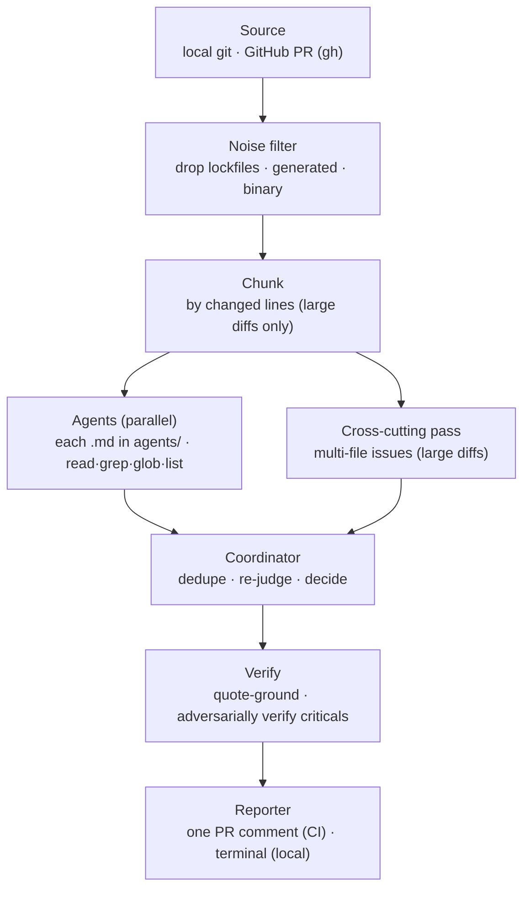

# @expo/code-review-cli

A config-driven, multi-agent AI code reviewer. Specialist agents review a diff in
parallel; a coordinator consolidates their findings into one structured review.
The same engine runs locally (advisory) and in CI (posts one PR comment). The CLI
is the **engine** — each repo supplies its own agents and settings under
`.expo-code-review/`, so behavior is configured per-repo, not baked in.

> **Status: experimental.** Comment-only and non-blocking — it never blocks a merge
> and never auto-approves. See [`ROADMAP.md`](./ROADMAP.md).

Inspired in part by Cloudflare's [_How we built our AI code review bot_](https://blog.cloudflare.com/ai-code-review/).



## Usage

Run via `npx @expo/code-review-cli <command>` (or the `ecr` / `expo-code-review`
binary once installed).

Reviewing a PR (`--pr`/`ci`) needs the GitHub CLI — `brew install gh && gh auth login`.
Everything else the reviewer needs (including the `opencode` runtime) ships with the
package.

### First-time setup

Scaffold, add credentials, verify.

```bash
# Scaffold .expo-code-review/ + a CI workflow (--no-workflow to skip)
npx @expo/code-review-cli init
```

Then give it model credentials. **Recommended: a Claude Pro/Max subscription** — the
scaffolded config uses OAuth by default, so just mint a token and export it under the
env var your `config.jsonc`'s `auth.tokenEnv` names:

```bash
# Mint a Claude Pro/Max token (prints an sk-ant-oat… token)
claude setup-token
# Export it under the env var your config.jsonc's auth.tokenEnv names
export ANTHROPIC_OAUTH_API_KEY=sk-ant-oat...
# Check env, config, and credentials
npx @expo/code-review-cli doctor
```

Prefer an Anthropic **API key**, or **OpenAI/GPT** or another provider? See
[Other providers & auth modes](#other-providers) at the bottom.

### Reviewing (already configured)

```bash
# Review working-tree changes; prints here, posts nothing
ecr review
# Review a GitHub PR by number (preview only)
ecr review --pr 4057
# …and post it as the PR comment
ecr review --pr 4057 --post
```

Options (most to least common):

| Flag | What it does |
| --- | --- |
| `--pr <n>` | Review GitHub PR #n by number (diff fetched via `gh`, no checkout); not combinable with `--base`/`--head`/`--staged`. |
| `--post` | With `--pr`, also post the result as the PR comment (needs `gh` auth). Omit to preview only; re-run with `--post` to publish. |
| `--staged` | Review only staged changes. |
| `--base <ref>` | Base ref to diff against (default: merge-base with the default branch). |
| `--head <ref>` | Head ref to diff (default: working tree, incl. uncommitted changes). |
| `--agents <a,b>` | Run only these agents (comma-separated ids); default: all. |
| `--route` | Let an LLM router pick the relevant agents from the diff. |
| `--repo <owner/repo>` | Repo for `--pr` (default: inferred from the current checkout). |
| `--json` | Emit machine-readable JSON on stdout. |
| `--no-fail` | Always exit 0 (otherwise a `request_changes` decision exits non-zero). |
| `-h`, `--help` | Show help. |

`--pr` uses the PR's diff (authoritative) but reads your checked-out files for
surrounding context; for full fidelity, `gh pr checkout <n>` first and run a plain
`ecr review`.

In CI it runs automatically from the scaffolded workflows — by label or a `/review`
comment (see **CI usage**). From Claude Code (or another agent), add a slash command
that runs it; eas-cli's
[`/expo-review`](https://github.com/expo/eas-cli/blob/main/.claude/commands/expo-review.md)
is a ready example to adapt.

### Command reference

| Command | What it does |
| --- | --- |
| `ecr init [--no-workflow] [--force]` | Scaffold `.expo-code-review/` (config, agents, prompts) + a CI workflow. |
| `ecr review [options]` | Review local changes and print an advisory review (default command). |
| `ecr ci` | Review the current GitHub PR and post/update a comment. For GitHub Actions. |
| `ecr doctor` | Check environment, config, and model credentials. |

(When developing this repo itself, use `bun run src/cli.ts <command>`.)

---

<details>
<summary><b>How it works</b></summary>

- **Source** — local git (working tree, staged, or a ref range) or a GitHub PR
  (diff + metadata fetched over the `gh` API).
- **Noise filter** — drops lockfiles, generated bundles/maps, snapshots, files
  matching the repo's `additionalIgnores`, and binary files (no textual diff to
  review). Filtered files are recorded, not silently dropped.
- **Chunking** — small PRs run in a single pass; large PRs are split into chunks
  bounded by changed lines, plus one combined **cross-cutting pass** that looks
  for issues spanning multiple changed files across every agent's concern.
- **Agents** — every `.md` file in `.expo-code-review/agents/` is an agent. They
  run in parallel with read-only repo tools (`read`/`grep`/`glob`/`list`).
- **Coordinator** — a single pass that dedupes, re-judges severity, and produces
  the final `{ decision, findings, summary }`.
- **Verify** — quote-grounds every finding against the real file and adversarially
  verifies criticals, so a confident-but-wrong finding doesn't ship.
- **Reporter** — posts/updates a single fingerprinted PR comment (CI), or prints
  a grouped summary (local). Findings below the configured severity floor are
  suppressed.

Built on the [OpenCode](https://opencode.ai) SDK, which spawns the model provider
and applies Anthropic prompt caching automatically.

</details>

<details>
<summary><b>Configuration — <code>.expo-code-review/</code></b></summary>

```
.expo-code-review/
  config.jsonc        # model, policy, noise, auth, break-glass, comment tag
  shared.md           # instructions prepended to every agent (optional)
  coordinator.md      # the consolidation prompt (required)
  agents/
    correctness.md    # each .md here is an agent (id = filename)
    security.md
    consistency.md
```

`shared.md` and `coordinator.md` are reserved names; every other `.md` in
`agents/` becomes an agent. Per-agent overrides go in each file's frontmatter:

```markdown
---
description: One line the router uses to decide relevance.
alwaysRun: true        # run even when the router would skip this agent
model: anthropic/claude-sonnet-5     # override the default model
temperature: 0.1
---

# Agent instructions in Markdown…
```

For a real-world example, see eas-cli's
[`.expo-code-review/`](https://github.com/expo/eas-cli/tree/main/.expo-code-review)
— correctness/security/consistency agents, Opus for security + the coordinator, and
per-repo `noise.additionalIgnores`.

`config.jsonc` (JSONC — comments + trailing commas supported):

```jsonc
{
  "model": "anthropic/claude-sonnet-5",       // default model for the specialists
  "policy": { "includeSuggestions": false },  // suppress suggestion-severity findings
  "chunk": { "maxChangedLines": 1000, "maxFiles": 20, "concurrency": 6 },
  "noise": { "additionalIgnores": ["packages/*/build/**"] },
  "breakGlass": { "marker": "/skip-review" }, // PR body marker that skips the review
  "commentTag": "expo-ai-code-reviewer",      // hidden tag used to find/update the comment
  "auth": { "mode": "oauth", "provider": "anthropic",
            "tokenEnv": "ANTHROPIC_OAUTH_API_KEY" }
}
```

</details>

<details>
<summary><b>Model selection</b></summary>

Precedence: **`REVIEWER_MODEL` env** (global override) → per-file **frontmatter
`model:`** → **`config.jsonc` `model`** (the default). So a repo can run a mixed
setup, and a developer can override everything locally.

- **Specialist agents** (correctness/security/consistency) benefit from a
  reasoning-tier model — **Sonnet** is the quality/speed sweet spot (default for
  correctness/consistency). **Opus** finds more but is slower and more
  rate-limited, so scope it to the highest-stakes agent: **security runs on Opus**
  (set in `security.md` frontmatter), the rest on Sonnet.
- **The coordinator** makes the final call (dedupe / re-judge / decide) — worth a
  strong model; set it in `coordinator.md` frontmatter.
- If latency/timeouts dominate on big PRs, moving the specialists to a faster model
  is the most direct lever (a real recall tradeoff — measure it).

There is no automatic cross-provider "equivalent" fallback — that would silently
change which model reviewed your code. Use an explicit override instead.

</details>

<details>
<summary><b>Reliability</b> — never hangs, never silently drops work</summary>

- **Per-task time caps** — chunk passes 15 min; cross-cutting 25 min; coordinator
  10 min. A global passes budget (32 min) bounds all passes incl. the subdivision
  waves, fitting inside the CI job's `timeout-minutes` (60).
- **Tool-call cap** — a pass that makes too many `read`/`grep` calls without
  finishing is *wandering*, not converging; hitting the cap trips the soft landing.
- **Soft landing on timeout** — at either cap, the run is interrupted and the agent
  is asked to return the findings it already has, rather than discarding its work.
- **Subdivide-on-timeout** — a pass that times out with nothing to show has its
  chunk split in half and the halves re-reviewed (recursively, down to a single
  file), then a fast **no-tools fallback** over the inlined diff. Only a genuinely
  un-reducible pass reports a coverage gap — and it is always reported, never silent.
- **Parse failures are retried** (same session, then once in a bounded fresh
  session) — separate from the timeout path.
- **A failed run never reads as "Approve"** — all passes fail → "could not
  complete"; some fail → never a clean approve, and coverage-reduced.
- **The coordinator can't sink the run** — if consolidation fails, findings are
  merged deterministically and still posted.
- **Coverage notes** — passes that timed out/failed are listed (routine noise
  filtering is *not* flagged — it's expected and stays in the run log).
- **CI always gets a terminal state** — on any failure the PR gets a "didn't run"
  comment, not a stuck reaction and silence.

</details>

<details>
<summary><b>CI usage</b></summary>

`ecr init --with-workflow` scaffolds a `pull_request` workflow. Split along a clean
line: **comments = one-shot actions, labels = persistent configuration.**

- **command workflow** — one-shot `/review` comments (maintainers): `/review`
  (router picks agents), `/review all`, `/review correctness security`. Never
  changes configuration.
- **auto workflow** — continuous review, configured by **labels**: `ai-review`
  (router), `ai-review:all`, `ai-review:<agent>` (e.g. `ai-review:security`;
  combine to widen), `ai-review:skip` (opt-out).
- **dismiss workflow** — `/dismiss <id> [… -- reason]` / `/undismiss <id>`
  (maintainers). Each finding shows a short `` `id:…` ``. Dismissal is a **display
  filter only** — the reviewer still analyzes everything, and a `critical`/`secrets`
  finding can never be hidden. (An inline `expo-code-review-ignore` comment on/above
  a line does the same, with the same critical/secrets carve-out.)

These workflows are comment-only (they never fail the PR's checks). The engine runs
as the published package via `npx`, so no PR-controlled code is built.

</details>

<details>
<summary><b>Run logs</b></summary>

Each run appends a JSON line to `.expo-code-review/.runs/reviews.jsonl` with the
inputs, decision, finding count, duration, per-agent cost, and aggregate token
usage (incl. prompt-cache read/write counts) — for auditing and measuring
cost/latency/cache reuse over time.

</details>

<a id="other-providers"></a>
<details>
<summary><b>Other providers & auth modes</b></summary>

The recommended setup is a Claude Pro/Max subscription (OAuth) — see Usage above.
Alternatives, all set in `config.auth` (credentials come from OpenCode):

- **Anthropic API key** — set `auth.mode` to `"api-key"` and point `tokenEnv` at the
  env var holding the key (e.g. `ANTHROPIC_API_KEY`); it's sent as `x-api-key`. Omit
  the `auth` block entirely to fall back to OpenCode's own login / `ANTHROPIC_API_KEY`.
- **OAuth (Pro/Max)** — `tokenEnv` holds an `sk-ant-oat…` token from
  `claude setup-token` (*not* an x-api-key); it's written to an isolated OpenCode
  `auth.json` as a bearer credential, using the native subscription path.
- **OpenAI / GPT, or another provider** — the current path is the `REVIEWER_MODEL`
  env override: `opencode auth login` once (pick the provider), then run with
  e.g. `REVIEWER_MODEL=openai/gpt-5.4-mini-fast`. It overrides every agent's model
  and uses your OpenCode login, so no `auth` block is needed. *(First-class
  per-provider config — Anthropic/OpenAI/others in `config.jsonc`, and mixing them
  per agent — is on the [roadmap](./ROADMAP.md).)*

There is no shared fallback key; if a run fails for lack of credentials, authenticate
a provider in OpenCode. `ecr doctor` diagnoses setup.

</details>
